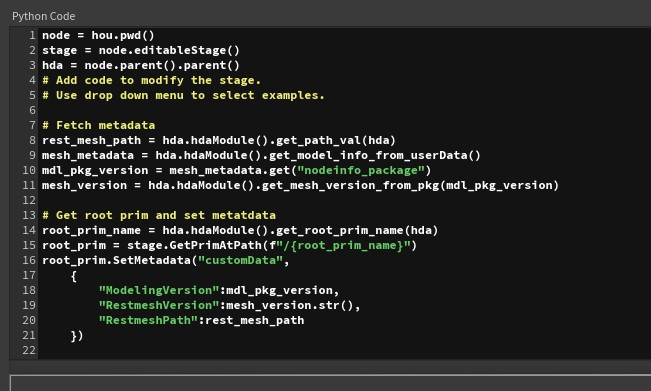
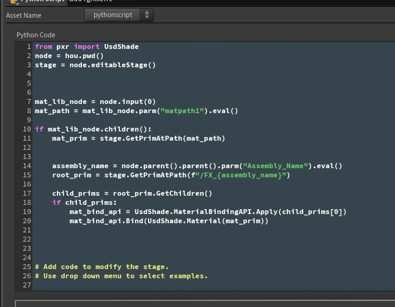

## Research URL
---

- [USD-mainPage](https://openusd.org/release/dl_downloads.html)
    - [USD Introduction and Overview](https://openusd.org/files/Siggraph2019_USD%20Introduction%20and%20Overview.pdf)
    - [USD Composition](https://openusd.org/files/Siggraph2019_USD%20Composition.pdf)
    - [USD Authoring and Advanced Features](https://openusd.org/files/Siggraph2019_USD%20Authoring%20and%20Advanced%20Features.pdf)
    - [Pipeline Case Studies](https://openusd.org/files/Siggraph2019_Pipeline%20Case%20Studies.pdf)
    - [Hydra](https://openusd.org/files/Siggraph2019_Hydra.pdf)
- [USD Basic terms](https://remedy-entertainment.github.io/USDBook/index.html)
- [USD-API](https://graphics.pixar.com/usd/release/api/index.html)
    - [Stage.h](https://openusd.org/release/api/usd_2usd_2stage_8h.html) - [class UsdStage](https://openusd.org/release/api/class_usd_stage.html) / [Layer.h](https://openusd.org/release/api/layer_8h.html) - [SdfLayer](https://openusd.org/release/api/class_sdf_layer.html) / [Prim.h](https://openusd.org/release/api/usd_2usd_2prim_8h.html) - [class UsdPrim](https://openusd.org/release/api/class_usd_prim.html)
- [USD Survival Guide](https://lucascheller.github.io/VFX-UsdSurvivalGuide/introduction/overview.html)

- [USD Survival Guide Github](https://github.com/LucaScheller/VFX-UsdSurvivalGuide/tree/main/files)
- [USD-Cookbook-Github](https://github.com/ColinKennedy/USD-Cookbook)
    
- [Maya USD Command](https://github.com/Autodesk/maya-usd/blob/dev/lib/mayaUsd/commands/Readme.md)

- [USD: Building Asset Pipelines](https://vimeo.com/211022588)
- [USD-Based Pipeline (2016)](https://vimeo.com/188191100)
- [Pixar BOF SIGGRAPH 2022](https://vimeo.com/752352357)
- [NVIDIA Developer 가이드](https://developer.nvidia.com/usd#sample)
- [Houdini USD workflow](https://youtu.be/2YBKWJJX2iQ)
- [Animal logic USD](https://www.youtube.com/watch?v=o6VwS7VVx1I&list=PLNUaMVwYjKk8QDlM8gQSLbl8jxLRgc7d6&index=1)
- [Dreamworks USD manager](http://www.usdmanager.org/index.html)
- [Dreamworks 80일간 USD 파이프라인 만들기 설계문서 (간략)](https://research.dreamworks.com/wp-content/uploads/2020/01/Zero-to-USD-with-notes.pdf)


## Term & Concepts
---

- Stage : this stands for high-level layer which contains other layers
- Layer : this is a layer which is made up for Stage
- Prim : the primary container object. this is comsist of Specifier (-> schema)

| Term | Definition | Why to use |
| ---- | ---------- | ---------- |
| Model Hierarchy | the hierarchy structure of USD | .. |
| Kind | the feature that decide type and role of prim.<br>There are five category<br>- model<br>- group<br>- assembly<br>- component<br>- subcomponent| to make usd readable and to check if the model hierarchy of usd is valid |
| Default prim | it stands for the prim which renderer need to look at. So, it show that which prim is the core prim or basic prim. | to make it easier for renderer to reference. and the rendere render a scene based on the default prims |
| LayerStack | The **ordered** set of layers.<br>as first and strongest | |
| Session Layer | the layer which is targeted to work on | |
| Namespace | this is equal to prim path<br>(ex : /Root/Child/SubChild ) | |


- Model Hierarchy

```
/World
    ├── /World/Character
    │      ├── /World/Character/Body
    │      └── /World/Character/Head
    │             ├── /World/Character/Head/Eyes
    │             └── /World/Character/Head/Mouth
    └── /World/Environment
           ├── /World/Environment/Trees
           └── /World/Environment/Sky

```

## Scripts exmaple
---

### Create or Open stage

```python
from pxr import Usd, UsdGeom

root_stage_usd_path = ".../asset.usd"
cur_stage = Usd.Stage.CreateNew(root_stage_usd_path)

cur_stage = Usd.Stage.Open(root_stage_usd_path)

```

### Create (Define) or Search Prim

```python
prim_path = "/root/child"

xform_prim = cur_stage.DefinePrim(prim_path , "xForm")

# using schema
xform_prim = UsdGeom.Xform.Define(stage, "/Root")

# Find prim
tar_prim = cur_stage.GetPrimAtPath(prim_path)
```

### Get and Set Defualt prim

```python
default_prim = stage.GetDefaultPrim()
stage.SetDefaultPrim(new_prim)
```

### Override Prim

```python
new_prim = stage.OverridePrim(f"/{new_default_prim_name}")
```

### Save stage or root layer

```python
# Save all layer under the current stage
stage.Save()

# Save only current root layer
stage.GetRootLayer().Save()
```

### Reference a layer and check a list of references

```python
from pxr import Usd

stage = Usd.Stage.Open("Stage_usd_file_path.usd")

root_prim = stage.GetPrimAtPath("/RootPrimName")

_usd_with_refs = "usd_filpath_referenced_in_the_stage.usd"

# Get a list of references and details of each reference
refs_metadata = root_prim.GetMetadata('references')
refs = refs_metadata.GetAddedOrExplicitItems()
for _ref in refs:
    print(_ref.assetPath)


# Add a usd as reference
root_prim.GetReferences().AddReference(_usd_with_refs)

stage.GetRootLayer().Save()


```

### Save metadata in houdini's lop network



### Bind material in houdini's lop network


<br>
<br>

## Diary

### Day 1 - build OpenUSD

- build Open USD using python
    - clone OpenUSD git repo
    - Open "x64 Native Tools Command Prompt"
    - run command below

```batch
C:\> python OpenUSD\build_scripts\build_usd.py "C:\path\to\my_usd_install_dir"
```

### Day 2 - Simple Sphere and Errors as to usdview

- Do tests with simple CMakeLists.txt and cpp code
    - Making a simple sphere

- Errors
    - fail to build `OpenUSD` because of `OneTbb` istalled by vcpkg
        - I installed usd library using vcpkg, and it affect `build_usd.py`
    - fail to open `usdView`
        - [Dependencies](https://github.com/lucasg/Dependencies?tab=readme-ov-file)

        ```batch
        Dependencies.exe -modules C:\Users\runab\OneDrive\dev\pipetemp\BuiltUSD\lib\python\pxr\UsdImagingGL\_usdImagingGL.pyd
        ```

        - this is because of houdini's usd paths
        - I removed the path, and then was able to open UsdView
    
    - 
    - 
    - 

- CMakeLists.txt

    ```cmake
    cmake_minimum_required(VERSION 3.10)
    project(SimpleUSDSphere)

    # C++ 표준 설정
    set(CMAKE_CXX_STANDARD 17)
    set(CMAKE_CXX_STANDARD_REQUIRED ON)

    add_compile_definitions(NOMINMAX WIN32_LEAN_AND_MEAN)

    # USD 라이브러리 경로 지정 (당신의 빌드된 USD 경로)
    # set(USD_ROOT "C:/Users/runab/OneDrive/dev/pipetemp/BuiltUSD")
    find_package(pxr REQUIRED)  # pxr는 USD의 CMake 패키지 이름

    message(STATUS "Imported targets from pxr: ${PXR_TARGETS}")
    message(STATUS "pxr library : ${PXR_LIBRARIES}")
    message(STATUS "pxr include : ${PXR_INCLUDE_DIRS}")


    # Python 찾기 (USD가 Python bindings를 요구하므로)
    find_package(Python3 REQUIRED COMPONENTS Interpreter Development)  # Python 3.x 개발 헤더 포함

    # 실행 파일 추가
    add_executable(SimpleUSDSphere src/main.cpp)

    # USD 라이브러리 링크 (usd_ 스타일 사용)
    # PXR_TARGETS 를 보면 공백, 그 의미는 그냥 pxr 을 앞에 안 붙이고 바로 사용
    target_link_libraries(SimpleUSDSphere PRIVATE usd usdGeom)

    # include 디렉토리 추가 (USD + Python)
    target_include_directories(SimpleUSDSphere PRIVATE 
        ${PXR_INCLUDE_DIRS}
        ${Python3_INCLUDE_DIRS}  # Python 헤더 (pyconfig.h 포함)
    )
    ```

- powershell : .ps1

    ```batch
    Remove-Item .\build\ -Recurse -Force -ErrorAction SilentlyContinue;
    New-Item -Path .\build -ItemType Directory | Out-Null;
    CMake -S . -B ./build -G "Visual Studio 17 2022" -DTBB_DIR=C:/Users/runab/OneDrive/dev/pipetemp/BuiltUSD/src/tbb/cmake -DOpenSubdiv_DIR=C:/Users/runab/OneDrive/dev/pipetemp/BuiltUSD/lib/cmake/OpenSubdiv
    ```

- c++ test code

    ```c++
    #include <pxr/usd/usd/stage.h>  // USD 스테이지를 위한 헤더
    #include <pxr/usd/usdGeom/sphere.h>  // Sphere 지오메트리를 위한 헤더
    #include <pxr/usd/usdGeom/xformCommonAPI.h>  // 위치/스케일 등의 변환을 위한 API
    #include <iostream>  // 콘솔 출력용

    int main() {
        // 새 USD 스테이지를 생성합니다. "simple_sphere.usda" 파일로 저장될 것입니다.
        std::cout << "Enter !!!! " << std::endl;
        pxr::UsdStageRefPtr stage = pxr::UsdStage::CreateNew("C:/Users/runab/OneDrive/dev/pipetemp/USDViewer02/data/simple_sphere.usda");
        if (!stage) {
            std::cerr << "USD 스테이지를 생성할 수 없습니다." << std::endl;
            return 1;
        }

        // 루트 아래에 "/sphere" 경로로 새 prim을 정의합니다.
        pxr::UsdPrim spherePrim = stage->DefinePrim(pxr::SdfPath("/sphere"), pxr::TfToken("Sphere"));
        
        // UsdGeomSphere API를 사용해 sphere 속성을 설정합니다.
        pxr::UsdGeomSphere sphere(spherePrim);
        sphere.CreateRadiusAttr().Set(1.0);  // 반지름을 1.0으로 설정 (기본 단위: 미터)

        // 위치를 설정합니다. (XformCommonAPI로 변환 적용)
        pxr::UsdGeomXformCommonAPI xformAPI(spherePrim);
        xformAPI.SetTranslate(pxr::GfVec3d(0.0, 0.0, 0.0));  // 위치: (0,0,0)
        xformAPI.SetScale(pxr::GfVec3f(1.0, 1.0, 1.0));  // 스케일: 기본 1배

        // 스테이지를 파일로 저장합니다.
        stage->GetRootLayer()->Save();

        std::cout << "USD 파일이 생성되었습니다: simple_sphere.usda" << std::endl;
        return 0;
    }
    ```

- Complete to open simpletSphere.usda using usdview.cmd
    - 


## Arnold Render Delegate Build
---
### 1. build enviroment

| OS : Rocky Linux            | Maya and Arnold | [Arnold SDK download](https://arnoldrenderer.com/download/archive/) |
| :---------------- | :------: | ----: |
|        |      |  |

| bashrc before build | bashrc after build | 
| :---------------- | :------: |
|   |      | 


### 2. How to
1. clone gits (OpenUSD / arnold-usd)
2. download arnold sdk
3. prepare python27 (not exists as default in rocky linux anymore)
4. do install python devel for pyconfig.h error
    ```
    dnf install python2-devel
    dnf install python3-devel
    ```
5. do build
    ```
    [OpenUSD]v23.08
    /usr/bin/python3.6 ./build_scripts/build_usd.py --force-all --build-shared --no-examples --no-docs --no-python-docs --ptex --openvdb --openimageio --opencolorio --alembic --hdf5 --materialx /opt/USD

    [arnold-usd]7.2.3.2
    cmake -DCMAKE_BUILD_TYPE=Release -DARNOLD_LOCATION=/opt/arnold_sdk/Arnold-7.1.3.2-linux -DUSD_LOCATION=/opt/USD -DCMAKE_CXX_STANDARD=14 -DBUILD_DOCS=false -DCMAKE_INSTALL_PREFIX=/opt/arnold_usd
    ```

* caution
    - Do not use python39 or other python verions with 'dnf install python3.X'
    - Use default python3.6 version
    - Reason : There is a conflict between python paths

6. use mayaUSD usdview to use
    ```
    {mayapy_path} /usr/autodesk/mayausd/maya2023/{mayausd_version}/mayausd/USD/bin/usdview {usd file}
    ```

### 3. Render result


<iframe width="750" height="505" src="https://www.youtube.com/embed/VIJQ38TgNN8?si=qA4xhzVjVp__QNCg" title="YouTube video player" frameborder="0" allow="accelerometer; autoplay; clipboard-write; encrypted-media; gyroscope; picture-in-picture; web-share" allowfullscreen></iframe>

<br>
<br>

## Warnning Message 
---

### 1. Material Bind Error

-  how to solve ?
	1. check exported data in usdview --> there is no warnning message
	2. compare between exported data and written data which is made by code
	2. /usersetup/linux/usd/OpenUSD_source/pxr/usd/usdShade/materialBindingAPI.cpp --> cause : HasAPI 
	3. find difference --> prepend apiSchemas = ["MaterialBindingAPI"]
	4. Do -->  geo_prim.ApplyAPI(UsdShade.MaterialBindingAPI)

### 2. Unresolved Reference Path

```
Unresolved reference path </Geometry> 
on prim @anon:000000005A89D200:LOP:rootlayer@,
@anon:000000005A89D000:LOP:rootlayer-session.usda@</asset>. 
(recomposing stage on stage @anon:000000005A89D200:LOP:rootlayer@ 
<00000001BB883200>) 
```

이 경고는 **USD(Universal Scene Description)**의 씬 구조에서 발생하는 경로 참조 문제를 나타냅니다. 경고를 해석하고 문제를 해결하려면 다음을 이해해야 합니다:

-  경고 원인
   1. **Unresolved Reference Path**:
      - 경고는 경로 `</Geometry>`가 참조되었지만, 해당 경로에 실제로 존재하는 프림(prim)이 없음을 나타냅니다.
      - 참조 경로는 종종 다른 USD 파일의 내용을 로드하거나, 다른 레이어에서 데이터를 가져오는 데 사용됩니다. 경고는 특정 레이어 또는 파일에서 `</Geometry>`를 찾을 수 없음을 의미합니다.

   2. **Prim 정보**:
      - 경고에서 `</asset>` 프림이 문제의 참조를 포함하고 있는 것으로 보입니다.
      - 이 프림이 USD 레이어에 정의된 참조(`references`) 또는 인스턴싱(`payloads`) 중 하나에서 문제가 있을 수 있습니다.
      - it means that the assembly asset usd can not recognize the default prim of the referenced usd

   3. **Stage 구성**:
      - 경고는 해당 참조가 `@anon:000000005A89D200:LOP:rootlayer@` 스테이지와 연결되어 있음을 나타냅니다. 익명의 스테이지나 세션 레이어(temporary, in-memory layers)에서 발생할 가능성이 높습니다.

- 해결 방법

  1. 참조 경로 확인
     - **USDView** 또는 사용하는 DCC 툴(Houdini, Maya 등)의 Stage Viewer에서 해당 프림(`</asset>`)을 선택합니다.
     - `references` 또는 `payloads` 속성을 확인하여 참조 경로가 올바르게 설정되었는지 점검하세요.
     - `<Geometry>` 프림이 로드되지 않았다면, 참조된 파일 경로나 경로 구성이 잘못되었을 가능성이 큽니다.

  2. 참조된 파일 확인
        - `@anon:000000005A89D200:LOP:rootlayer@` 또는 `@anon:000000005A89D000:LOP:rootlayer-session.usda@`에 정의된 내용을 확인하여 `</Geometry>` 프림이 존재하는지 확인하세요.
        - 만약 경로가 다른 USD 파일에 있는 데이터를 참조하려 한다면, 참조된 파일이 올바르게 로드되고 있는지 확인합니다.

  3. **Check if the default prim is set correctly**
     - you need to check if the default prim is set correctly to the prim which exists in that usd file. 
   

  4. 경로 수정
      - 경로 문제를 수정하려면:
        - 파일 경로가 절대 경로인지, 상대 경로인지 확인하고 올바른 경로로 업데이트합니다.
        - `references`를 사용하는 경우 정확한 파일 이름과 경로를 지정하세요.
      - Example:
        ```usd
        def "asset"
        {
            references = @path/to/geometry_file.usda@
        }
        ```
