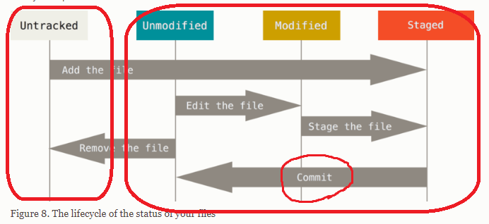

## 2.2 Git Basics - Recording Changes to the Repository
- Remember that each file in your working directory can be in one of two states: **tracked** or **untracked**
    - **Tracked files** are files that were in the last snapshot, as well as any newly staged files; they can be **unmodified**, **modified**, or **staged**. In short, tracked files are files that Git knows about.
    - **Untracked files** are everything else — any files in your working directory that were **not in your last snapshot** and are **not in your staging area**.

 

