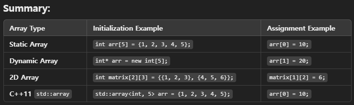
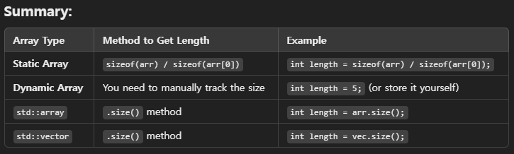
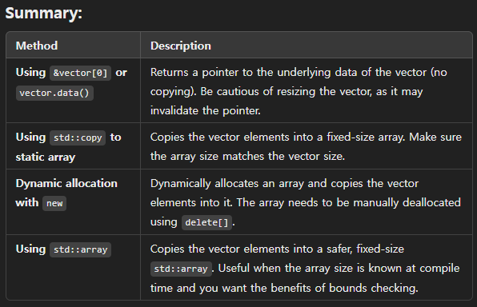
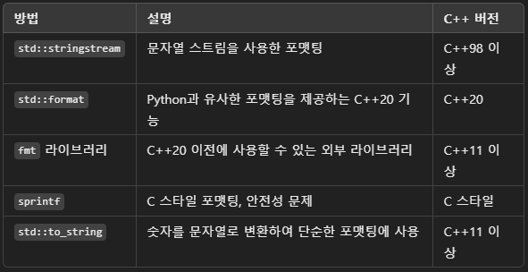

## C++ 9 characteristic

Modern C++ introduces various improvements and new features to enhance both performance and code readability. Let's break down some key aspects of modern C++ syntax, starting with a few major updates from C++11 and onwards:

### 1. Auto Keyword  
- The `auto` keyword allows the compiler to automatically deduce the type of a variable at compile time.

    ```cpp
    auto x = 10;     // int
    auto y = 3.14;   // double
    auto str = "Hello";  // const char*
    ```

### 2. Range-Based For Loop
- C++11 introduced range-based for loops to simplify iterating through collections.

    ```cpp
    std::vector<int> v = {1, 2, 3, 4, 5};
    for (auto elem : v) {
        std::cout << elem << std::endl;
    }
    ```

### 3. Lambda Expressions  
- Lambda expressions enable inline functions, useful for short, unnamed functions.

    ```cpp
    auto sum = [](int a, int b) {
        return a + b;
    };
    std::cout << sum(5, 3);  // Outputs 8
    ```

### 4. Smart Pointers
- Smart pointers manage the lifecycle of dynamically allocated objects automatically.

- types
    - `std::unique_ptr`: Ensures exclusive ownership.
    - `std::shared_ptr`: Allows multiple ownership.
    - `std::weak_ptr`: Non-owning reference to an object managed by `std::shared_ptr`.

    ```cpp
    std::unique_ptr<int> ptr = std::make_unique<int>(42);
    std::shared_ptr<int> sharedPtr = std::make_shared<int>(10);
    ```

### 5. Move Semantics and `std::move`
- Move semantics allow resources (e.g., memory) to be transferred rather than copied.

    ```cpp
    std::vector<int> v1 = {1, 2, 3};
    std::vector<int> v2 = std::move(v1);  // v1 is now empty, and v2 takes over the data
    ```

### 6. constexpr
- The `constexpr` keyword allows the evaluation of functions or variables at compile time.

    ```cpp
    constexpr int square(int x) {
        return x * x;
    }
    constexpr int result = square(5);  // Computed at compile time
    ```

### 7. Structured Bindings (C++17)
- This feature allows you to unpack tuples, pairs, or structs into multiple variables.

    ```cpp
    std::pair<int, double> p = {1, 2.5};
    auto [x, y] = p;  // x = 1, y = 2.5
    ```

### 8. std::optional (C++17)
- `std::optional` represents a value that may or may not be present.

    ```cpp
    std::optional<int> maybeInt;
    if (maybeInt) {
        std::cout << *maybeInt;
    }
    ```

### 9. Type Traits and `std::enable_if`  
- Type traits and SFINAE allow template metaprogramming, enabling or disabling certain functions based on type conditions.

    ```cpp
    template <typename T>
    typename std::enable_if<std::is_integral<T>::value>::type
    printIfInt(T t) {
        std::cout << "Integer: " << t << std::endl;
    }
    ```

---


## Varaible initialization

C++ offers several ways to initialize variables, with each style evolving over different versions of the language. These initializations cover different data types, from primitive types to user-defined objects. Here's an overview of the key types of initialization in C++:

### 1. Copy Initialization

- This is the simplest and oldest form of initialization in C++. It uses the assignment operator (`=`) to initialize a variable.

    ```cpp
    int x = 10;             // Primitive type
    std::string str = "Hello";  // Class type (std::string)
    ```

- **How it works**: The object is constructed first and then assigned a value. This can invoke a copy constructor (for objects).

### 2. Direct Initialization

- In this form, the variable is initialized directly using parentheses. It's more efficient for class types because it avoids the extra step of copy assignment.

    ```cpp
    int x(10);                // Primitive type
    std::string str("Hello");  // Class type (std::string)
    ```

- **How it works**: The object is constructed directly with the specified value, potentially calling a constructor for objects.

### 3. List Initialization (C++11)
- Also known as *uniform initialization*, this was introduced in C++11. It uses curly braces `{}` to initialize variables.

#### a) **Braced Initialization (Direct List Initialization)**

    ```cpp
    int x{10};                // Primitive type
    std::string str{"Hello"};  // Class type (std::string)
    ```

#### b) **Aggregate Initialization**

- For initializing aggregate types (like arrays or structs), you can use brace initialization.

    ```cpp
    std::array<int, 3> arr = {1, 2, 3};  // Array initialization
    ```

#### c) **Initializer List (std::initializer_list)**

- Classes can be initialized with a list of values by providing an initializer list constructor.

    ```cpp
    std::vector<int> vec = {1, 2, 3, 4, 5};  // Uses std::initializer_list
    ```

- **Advantages**:  
  - Prevents **narrowing conversions** (e.g., floating point to integer conversions).
  - Offers consistent syntax for initializing different types of objects.
  - Reduces ambiguity and potential errors in initialization.

### 4. Default Initialization

- When a variable is declared but not explicitly initialized, it undergoes default initialization.

    ```cpp
    int x;  // x is uninitialized (may contain garbage value)
    std::string str;  // Default constructor is called; str is an empty string
    ```

- **Primitive types**: Local primitive types are left uninitialized.
- **Objects**: Objects are initialized via their default constructors.

### 5. Value Initialization

- This is where a variable is initialized to a zero or equivalent default value. For objects, it calls the default constructor, and for primitive types, it initializes them to zero.

#### a) **For Primitive Types**

    ```cpp
    int x{};   // Zero-initialization: x is 0
    ```

#### b) **For User-Defined Types**

    ```cpp
    std::string str{};  // Default-initialized as an empty string
    ```

- **When it's used**: When you use empty braces (`{}`) or parentheses `()` to initialize a variable, the variable is value-initialized.

### 6. Zero Initialization

- When variables are zero-initialized, their values are explicitly set to zero (for built-in types) or default-initialized (for user-defined types).

- **Zero-initialization occurs** when variables are declared as static, as globals, or as members of a class with no constructors. For example:

    ```cpp
    static int x;  // x is zero-initialized to 0
    ```

### 7. Move Initialization (C++11)

- Move initialization occurs when you use `std::move` to transfer ownership of resources (typically from an object that is no longer needed).

    ```cpp
    std::vector<int> vec1 = {1, 2, 3};
    std::vector<int> vec2 = std::move(vec1);  // Moves vec1's resources to vec2
    ```

- **When to use**: When the object you're moving from is no longer needed, so its contents can be transferred rather than copied.

### 8. Reference Initialization

- References must be initialized when declared, and they reference an existing variable. A reference cannot be re-assigned once it is initialized.

    ```cpp
    int x = 10;
    int& ref = x;  // ref is a reference to x
    ```

- **Note**: `const` references can bind to temporary objects (rvalues).

### 9. Pointer Initialization

- Pointers can be initialized to null or point to a valid memory address.

    ```cpp
    int* ptr = nullptr;   // C++11 nullptr
    int* ptr2 = &x;       // Pointer to x
    ```

---

### **Summary Table**

| **Initialization Type**       | **Syntax Example**                         | **Description**                                                                 |
|-------------------------------|--------------------------------------------|---------------------------------------------------------------------------------|
| **Copy Initialization**        | `int x = 10;`                              | Assignment-style initialization; may invoke copy constructor.                   |
| **Direct Initialization**      | `int x(10);`                               | Directly initializes the variable, often more efficient for objects.            |
| **List Initialization**        | `int x{10};` or `std::vector<int> v{1,2};` | Uses curly braces `{}`; prevents narrowing conversions.                         |
| **Default Initialization**     | `int x;`                                   | No explicit initialization; may result in garbage values for primitive types.   |
| **Value Initialization**       | `int x{};`                                 | Initializes primitive types to zero; calls default constructors for objects.    |
| **Zero Initialization**        | `static int x;`                            | Sets primitive types to zero, or calls default constructors.                    |
| **Move Initialization**        | `std::move(obj)`                           | Transfers ownership of resources from one object to another.                    |
| **Reference Initialization**   | `int& ref = x;`                            | Initializes a reference to refer to an existing variable.                       |
| **Pointer Initialization**     | `int* ptr = nullptr;`                      | Initializes a pointer; often initialized with `nullptr`.                        |

---

Do you want to explore any of these initialization styles in more depth or see code examples for specific use cases?


## Various loop

### 1. `for` Loop
- The `for` loop is used when you know in advance how many times you want to iterate through the block of code. It consists of three parts: initialization, condition, and increment/decrement.

- Syntax:
    ```cpp
    for (initialization; condition; increment) {
        // Code to be executed
    }
    ```

#### Example:
    ```cpp
    for (int i = 0; i < 5; ++i) {
        std::cout << i << " ";  // Output: 0 1 2 3 4
    }
    ```

- **Use Case**: Best for situations where the number of iterations is known beforehand (e.g., looping over arrays, vectors with known size).

### 2. `while` Loop
- The `while` loop is used when the number of iterations is not known, and you want to loop until a condition becomes false.

- Syntax:
    ```cpp
    while (condition) {
        // Code to be executed
    }
    ```

- Example:
    ```cpp
    int i = 0;
    while (i < 5) {
        std::cout << i << " ";  // Output: 0 1 2 3 4
        ++i;
    }
    ```

- **Use Case**: Best when you want to loop based on some condition that could change during execution (e.g., waiting for user input, reading from a file).


### 3. Range-Based `for` Loop (C++11 and Later)
- The range-based `for` loop simplifies iteration over containers (like arrays, vectors, lists). It automatically handles the iterator behind the scenes.

- Syntax:
    ```cpp
    for (element_type variable : collection) {
        // Code to be executed
    }
    ```

- Example:
    ```cpp
    std::vector<int> vec = {1, 2, 3, 4, 5};
    for (int elem : vec) {
        std::cout << elem << " ";  // Output: 1 2 3 4 5
    }
    ```

- **Use Case**: Best for iterating over containers (arrays, vectors, lists) in a cleaner, more readable way.


### Comparison Table

| **Loop Type**          | **Syntax Example**                                     | **When to Use**                                                                |
|------------------------|--------------------------------------------------------|--------------------------------------------------------------------------------|
| **`for` loop**          | `for (int i = 0; i < N; ++i)`                          | Known number of iterations, concise control over loop index.                   |
| **`while` loop**        | `while (condition)`                                    | Unknown number of iterations, condition checked before entering the loop.       |
| **Range-based `for`**   | `for (auto elem : collection)`                         | Clean, efficient way to iterate over containers (arrays, vectors, lists, etc.). |

---

## std library
### std::min
    - find the smallest number among three number
    ```
    // Using std::min to find the smallest number
    int smallest = std::min(num1, std::min(num2, num3));
    ```

## Array / List / Vector

### 1. Array
- **Type:** Fixed-size, contiguous block of memory.
- **Syntax:**  
  ```cpp
  int arr[5] = {1, 2, 3, 4, 5};
  ```
- **Key Characteristics:**
  - **Fixed size:** The size is determined at compile-time and cannot be changed.
  - **Memory layout:** Stored contiguously in memory, which makes access to elements very fast (O(1) for access).
  - **No dynamic resizing:** You cannot add or remove elements after the array is created.
  - **No overhead:** Arrays are simple and have no extra memory overhead compared to lists or vectors.
  - **No safety checks:** Accessing out-of-bounds elements leads to undefined behavior.

- **Use Case:** Best for situations where the size of the array is known beforehand and doesn't change, and fast access to elements is important (e.g., low-level programming, embedded systems).

### 2. List (`std::list`)
- **Type:** Doubly linked list.
- **Syntax:**  
  ```cpp
  std::list<int> lst = {1, 2, 3, 4, 5};
  ```

- **Key Characteristics:**
  - **Dynamic size:** The size can grow or shrink as elements are inserted or removed.
  - **Non-contiguous memory:** Elements are not stored in contiguous memory, and each element points to the next and previous elements. This makes accessing elements slower (O(n) for access).
  - **Efficient insertions/removals:** Inserting or removing elements (except at the end) is O(1) because only pointers need to be updated.
  - **Memory overhead:** Each element requires extra memory for the pointers to the next and previous elements.
  
- **Use Case:** Suitable when frequent insertions and deletions are required in the middle of the collection, but fast random access is not necessary (e.g., implementing queues, managing large datasets where resizing is needed).

### 3. Vector (`std::vector`)
- **Type:** Dynamic array.
- **Syntax:**  
  ```cpp
  std::vector<int> vec = {1, 2, 3, 4, 5};
  ```

- **Key Characteristics:**
  - **Dynamic size:** The size can grow dynamically as new elements are added.
  - **Contiguous memory:** Elements are stored in contiguous memory blocks, similar to arrays, which makes access very fast (O(1) for access).
  - **Resizing:** When the vector runs out of capacity, it reallocates more memory (typically doubling the capacity), which involves copying elements to a new memory block.
  - **Efficient access:** Accessing elements is fast (O(1)), but insertions and deletions in the middle or beginning can be slow (O(n)) due to shifting of elements.
  - **Memory overhead:** When reallocating memory, some extra capacity is allocated to avoid frequent reallocations, which adds a small memory overhead.

- **Use Case:** Best when the size of the collection changes dynamically, and fast access to elements is important (e.g., dynamic arrays, stacks, dynamic lists).

---

### **Comparison Table**

| Feature              | **Array**            | **List (`std::list`)** | **Vector (`std::vector`)** |
|----------------------|----------------------|------------------------|----------------------------|
| **Size**             | Fixed at compile-time| Dynamic                | Dynamic                    |
| **Memory Layout**    | Contiguous           | Non-contiguous         | Contiguous                 |
| **Element Access**   | O(1) (Direct)        | O(n) (Sequential)      | O(1) (Direct)              |
| **Insert/Remove (Start/Middle)** | O(n)              | O(1)                   | O(n)                       |
| **Insert/Remove (End)** | O(1)              | O(1)                   | O(1)                       |
| **Resizing**         | Not possible         | Automatic              | Automatic (with reallocation) |
| **Memory Overhead**  | None                 | High (pointers)        | Low (extra capacity)       |

---

### **Summary:**
- **Array**: Use when you know the size of the collection upfront and need fast access to elements.
- **List**: Use when frequent insertions/deletions are needed, especially in the middle or beginning of the collection.
- **Vector**: Use when you need a dynamic size but still want fast random access.

If you want to explore code examples or specific performance metrics, let me know!

## Various array initialization


### 1. Static Array

```
    // 1. Initialize array with 5 elements
    int arr[5] = {1, 2, 3, 4, 5};   
    // 2. The remaining elements are initialized to 0: {1, 2, 0, 0, 0}
    int arr[5] = {1, 2};            
    // 3. Uninitialized array, elements contain garbage values
    int arr[5];  
    // 4. All elements are initialized to 0
    int arr[5] = {}; 
    // 5. Uninitialized array
    int arr[5];  
    arr[0] = 10;
    arr[1] = 20;
    arr[2] = 30;
    arr[3] = 40;
    arr[4] = 50;

```

### 2. Dynamic Array

```
    // 1. Dynamically allocate an array of 5 integers
    int* arr = new int[5];  
    arr[0] = 1;
    arr[1] = 2;
    arr[2] = 3;
    arr[3] = 4;
    arr[4] = 5;

    // 2. Deallocate the dynamic array
    delete[] arr;  
```

### 3. 2DArray

```
    int matrix[2][3] = {
                        {1, 2, 3}, 
                        {4, 5, 6}
                    };  // 2x3 matrix

```

### 4. C++11 Style Deduced size Initialization (List Initialization)

```
    int arr[] = {10, 20, 30, 40};  // Size deduced automatically from the initializer list
```

### 5. std::array

```
    #include <array>
    std::array<int, 5> arr = {1, 2, 3, 4, 5};  // std::array initialization
    
    // assign value like normal arrays
    arr[0] = 10;
    arr[1] = 20;


```

## Lvalue and Rvalue / pass by what

In C++, **pass by value** and **pass by reference** are two different methods for passing arguments to functions. To fully understand how these work, it’s important to connect the concepts of **lvalue** and **rvalue**.

### **1. Lvalue vs. Rvalue**
- **Lvalue (Left Value)**: Refers to an object that persists beyond a single expression. It's essentially a memory address or a variable you can assign to.
  
  Example:
  ```cpp
  int x = 10; // 'x' is an lvalue
  ```

- **Rvalue (Right Value)**: Refers to a temporary value or object that does not persist beyond the current expression. You cannot assign to an rvalue.
  
  Example:
  ```cpp
  int y = x + 5; // 'x + 5' is an rvalue (a temporary result)
  ```

### **2. Pass by Value**
When passing by value, a **copy** of the argument is passed to the function. This means changes made to the parameter inside the function will not affect the original argument.

- **Behavior**: The function gets a copy of the original argument. Any modifications made to the parameter inside the function do not affect the original variable.
  
#### Example of Pass by Value:
```cpp
void modify(int a) {
    a = 20; // This change only affects the local copy 'a', not the original argument
}

int main() {
    int x = 10;
    modify(x);  // x is passed by value, so 'x' remains 10
    std::cout << x;  // Output: 10
    return 0;
}
```

In this case, `x` is an **lvalue**, and the function `modify` receives a **copy** of `x` as its parameter. Modifying `a` inside the function has no effect on `x`.

- **rvalue in Pass by Value**: You can also pass an rvalue (temporary value) by value since it’s copied to the function parameter.

```cpp
modify(5); // This works because the function will copy the value 5 to 'a'
```

### **3. Pass by Reference**
When passing by reference, the function receives a **reference** to the original argument, allowing it to modify the original variable.

- **Behavior**: The function gets a reference to the original argument, so any changes made to the parameter inside the function will directly affect the original variable.

#### Example of Pass by Reference (with lvalue):
```cpp
void modify(int& a) {
    a = 20; // This modifies the original argument
}

int main() {
    int x = 10;
    modify(x);  // x is passed by reference, so 'x' is modified to 20
    std::cout << x;  // Output: 20
    return 0;
}
```

In this case, `x` is an **lvalue** and is passed by reference, allowing the function to modify the original variable `x`.

- **rvalue in Pass by Reference**: You **cannot** pass an rvalue (like `5`) to a function that expects a regular lvalue reference (`int&`), because rvalues are temporary and do not have a persistent memory address.

```cpp
// This will cause an error:
modify(5);  // ERROR: Cannot bind rvalue to lvalue reference
```

### **4. Pass by Rvalue Reference (C++11 and Later)**
C++11 introduced **rvalue references** (denoted by `&&`), which allow you to pass rvalues (temporary values) to functions by reference. This is useful in certain situations like implementing move semantics, which avoids copying large objects unnecessarily.

- **Behavior**: The function can "steal" the resources of a temporary object (rvalue) and reuse them, avoiding costly deep copies.

#### Example of Pass by Rvalue Reference:
```cpp
void modify(int&& a) {
    a = 20;  // Modifies the temporary rvalue
}

int main() {
    modify(5);  // OK: rvalue (temporary value) is passed by rvalue reference
    return 0;
}
```

In this case, `5` is an **rvalue**, and the function `modify(int&&)` can take it as a reference, allowing you to modify the temporary value.

### **Summary:**

| **Concept**        | **lvalue**                             | **rvalue**                              |
|--------------------|----------------------------------------|-----------------------------------------|
| **Pass by Value**   | Copies the lvalue to the function.     | Copies the rvalue to the function.      |
| **Pass by Reference (`int&`)** | Modifies the original lvalue.             | Cannot bind rvalue to lvalue reference. |
| **Pass by Rvalue Reference (`int&&`)** | Not applicable, only for rvalue.      | Allows modifying the rvalue directly.   |

### **When to Use Each:**
- **Pass by Value**: Use when the function doesn't need to modify the original argument, and copying the argument is inexpensive.
- **Pass by Reference**: Use when the function needs to modify the original argument or when copying is expensive (e.g., large objects).
- **Pass by Rvalue Reference**: Use when you want to transfer ownership of a temporary object’s resources (e.g., in move semantics or when avoiding unnecessary copies).

Would you like to see more specific examples, such as how move semantics work with rvalue references?


## Lenght of Array and Vector

### 1. Len of Static Array
- total size of the array in bytes and then divide by the size of one element.

```
    int arr[5] = {1, 2, 3, 4, 5};

    // Get the length of the array
    int length = sizeof(arr) / sizeof(arr[0]);

    std::cout << "Length of the array: " << length << std::endl;

```

### 2. Len of a Dynamic Array (Allocated with new)
- For dynamic arrays allocated using new, the size information is not stored, and the sizeof operator will only give the size of the pointer, not the array. This means you need to manually keep track of the size when you allocate the array.

```
    int* arr = new int[5];  // Dynamically allocate an array of 5 integers
    int length = 5;  // You need to track the length yourself

    std::cout << "Length of the dynamic array: " << length << std::endl;
    delete[] arr;  // Don't forget to free the memory
```

### 3. Length of std::array (C++11 and Later)
- If you are using std::array from C++11, you can use the .size() method to get the number of elements in the array.

```
    #include <array>
    #include <iostream>

    std::array<int, 5> arr = {1, 2, 3, 4, 5};

    // Get the length of the std::array
    int length = arr.size();

    std::cout << "Length of the std::array: " << length << std::endl;
```

### 4. Length of std::vector

```
    #include <vector>
    #include <iostream>

    std::vector<int> vec = {1, 2, 3, 4, 5};

    // Get the length of the vector
    int length = vec.size();

    std::cout << "Length of the vector: " << length << std::endl;
```

## convert from Vector to Array

### 1. Using &vector[0] 
- to Get a Pointer to the Underlying Array

```
    #include <vector>
    #include <iostream>

    int main() {
        std::vector<int> vec = {1, 2, 3, 4, 5};

        // Get a pointer to the first element of the vector (C-style array)
        int* arr = &vec[0];  // or use vec.data()

        // Now you can use 'arr' as a C-style array
        for (int i = 0; i < vec.size(); ++i) {
            std::cout << arr[i] << " ";  // Output: 1 2 3 4 5
        }

        return 0;
    }
```

### 2. Using std::copy 
- to Copy Vector Elements into a Static Array

```
    #include <vector>
    #include <iostream>
    #include <algorithm>  // For std::copy

    int main() {
        std::vector<int> vec = {1, 2, 3, 4, 5};

        // Create a C-style array with the same size as the vector
        int arr[5];  // Make sure the size matches vec.size()

        // Copy elements from vector to array
        std::copy(vec.begin(), vec.end(), arr);

        // Now you can use 'arr' as a C-style array
        for (int i = 0; i < 5; ++i) {
            std::cout << arr[i] << " ";  // Output: 1 2 3 4 5
        }

        return 0;
    }

```

### 3. Dynamic Allocation 
- for Converting to a Dynamically Allocated Array

```
    #include <vector>
    #include <iostream>

    int main() {
        std::vector<int> vec = {1, 2, 3, 4, 5};

        // Dynamically allocate an array with the same size as the vector
        int* arr = new int[vec.size()];

        // Copy elements from the vector to the array
        std::copy(vec.begin(), vec.end(), arr);

        // Use the dynamically allocated array
        for (size_t i = 0; i < vec.size(); ++i) {
            std::cout << arr[i] << " ";  // Output: 1 2 3 4 5
        }

        // Don't forget to free the dynamically allocated memory
        delete[] arr;

        return 0;
    }

```

### 4. Using std::array (C++11)

    #include <vector>
    #include <array>
    #include <iostream>

    int main() {
        std::vector<int> vec = {1, 2, 3, 4, 5};

        // Create a std::array with the same size as the vector
        std::array<int, 5> arr;

        // Copy elements from vector to std::array
        std::copy(vec.begin(), vec.end(), arr.begin());

        // Now you can use 'arr' as a safer, fixed-size array
        for (int i = 0; i < arr.size(); ++i) {
            std::cout << arr[i] << " ";  // Output: 1 2 3 4 5
        }

        return 0;
    }


## string formatting

### 1. std::stringstream

    
    #include <iostream>
    #include <sstream>  // for std::stringstream
    #include <string>

    int main() {
        int age = 25;
        double height = 180.5;
        std::string name = "John";

        std::stringstream ss;
        ss << "Name: " << name << ", Age: " << age << ", Height: " << height << " cm";

        std::string formattedString = ss.str();  // 스트림 내용을 문자열로 변환
        std::cout << formattedString << std::endl;
        return 0;
    }
    

### 2. std::format (C++ 20)


    #include <iostream>
    #include <format>  // C++20 std::format
    #include <string>

    int main() {
        int age = 25;
        double height = 180.5;
        std::string name = "John";

        // std::format을 사용한 문자열 포맷팅
        std::string formattedString = std::format("Name: {}, Age: {}, Height: {} cm", name, age, height);

        std::cout << formattedString << std::endl;

        return 0;
    }


### 3. sprintf 


    #include <iostream>
    #include <cstdio>  // for sprintf
    #include <string>

    int main() {
        int age = 25;
        double height = 180.5;
        const char* name = "John";

        char buffer[100];  // 결과를 저장할 버퍼

        // sprintf를 사용한 포맷팅
        std::sprintf(buffer, "Name: %s, Age: %d, Height: %.1f cm", name, age, height);

        std::cout << buffer << std::endl;

        return 0;
    }


### 4. std::to_string


    #include <iostream>
    #include <string>

    int main() {
        int age = 25;
        double height = 180.5;
        std::string name = "John";

        // std::to_string을 사용한 포맷팅
        std::string formattedString = "Name: " + name + ", Age: " + std::to_string(age) + ", Height: " + std::to_string(height) + " cm";

        std::cout << formattedString << std::endl;

        return 0;
    }
