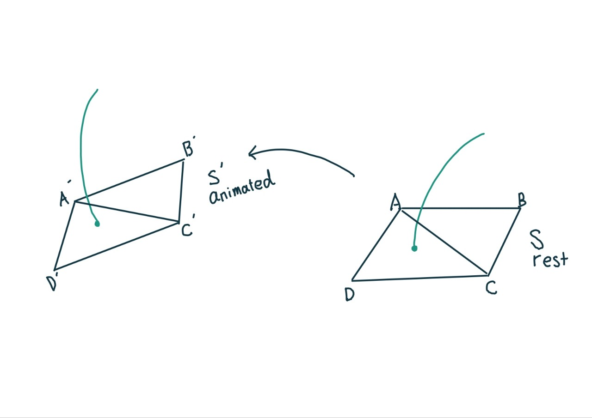
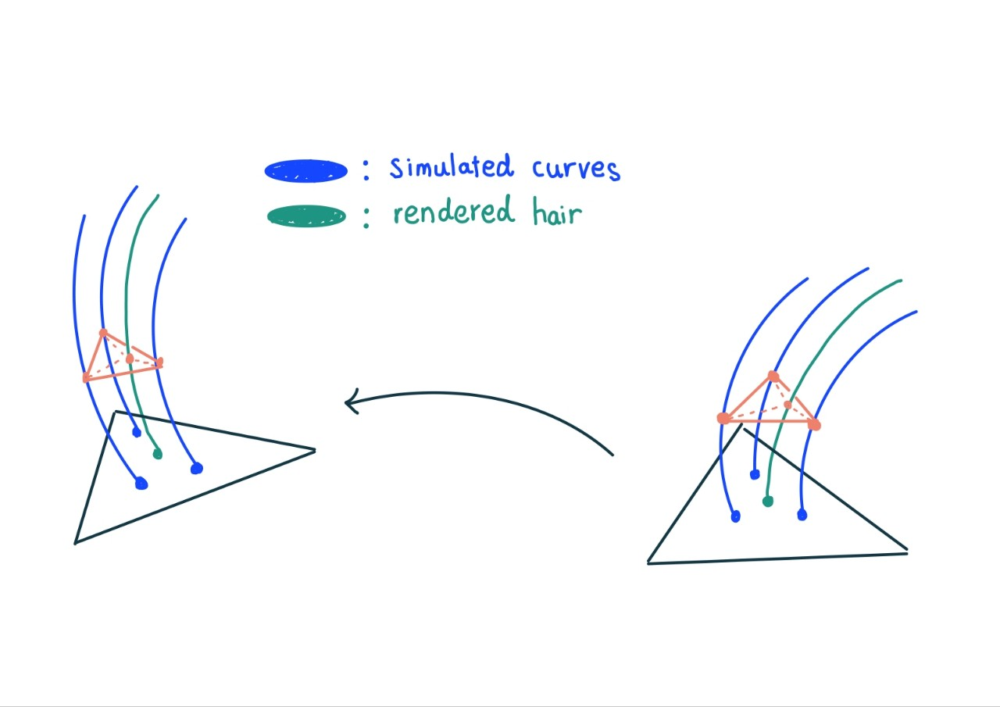

## Math

### Deviation (편차)
- Definition : this is a expression that represent how much something is far from baseline / average.

### Perpendicular & Cross section
- ex) between the unit vector perpendicular to the cross section and the tangent to the centre line
- Explanation :
    ```
          단면
   -----------
  |           |
  |           |
  |    ●------|-----> 중심선의 접선 벡터
  |           |       (Tangent to the centre line)
  |           |
   -----------
        |
        |
       \|/
  단면에 수직인 단위 벡터
(Unit vector perpendicular to the cross section)

    ```

### Perpendicular & Orthogonal
- Definition : they are same meaning. 90 &deg;
- Comparision : 
    - Perpendicular : normally used in Geometry
    - Orthogonal : normally used in lineary algebra (vector space)
- Use case:
    - Orthonormal : this is a relationship between two vectors. so if the two vector

### Surface normal
- [Surface normal docs link](https://courses.washington.edu/arch481/1.Tapestry%20Reader/1.3D%20Data/5.Surface%20Normals/0.default.html)
- Definition : this is a vector which is pointing perpendicular to the surface
- How to calculate : 
    1. defince surface which is composed of four or three edges
    2. get two vectors from the edges and the two vector are connected
    3. **calculate cross-product of the two vector, then the resulting vector is surface normal**


### Frenet-Serret formula
- Definition : this is a formula that represent how exact point (particle) move along curve using Normal (N) / Tangent (T) / Bi-normal (B)
- Use case
    - because it isn't for represent one object, it isn't good to be used in calculating object stuff.
    - it is good for calculating movement of point
    - but we can use N / T / B concept in context of how object is moved in terms of orientation.

### Vector Dot & Cross product (Meaning)
- [docs link](https://blog.naver.com/lavacat94/221514187661)
- Meaning
  1. Dot product :
     - $\vec{A} \cdot \vec{B} = \vert \vec{A} \vert \vert \vec{B} \vert \cos\theta$
     - if result of dot product == 0 : two vectors are in perpendicular
     - if result of dot product >  0 : angle of two vectors is less than 90&deg;
     - if result of dot product <  0 : angle of two vectors is more than 90&deg;
     - if calculate dot product with itself : reuslt is that square of itself
     - if result of dot prouct == $\vert 1 \vert$ : two vectors are parallel
  2. Cross Product :
     - $\vec{A} \times \vec{B} = \vec{A} \vec{B} \sin\theta$
     - result is a vector which is perpendicular to two vectors

### Vector projection
- Meaning : a vector which is align with target vector while maintaining its scale or size.
- **Usages**
  1. **Lighting and Shading**
     - **Diffuse Lighting**: Vector projection is used to calculate how light interacts with surfaces. Specifically, the dot product (which is closely related to projection) of the light direction vector and the surface normal vector is used to determine the intensity of diffuse reflection, which affects how bright or dark a surface appears under a light source.
     - **Specular Reflection**: To calculate the specular highlight, the reflection vector is projected onto the view direction vector, helping determine the shininess and the intensity of the specular highlight on the surface.

  2. **Surface Normals**
      - **Normal Mapping**: Vector projection is used in normal mapping, a technique where surface normals are altered using a texture (normal map) to create the illusion of complex surface details on a flat polygon. The light vector is projected onto the normal vector derived from the normal map to calculate the resulting lighting effects.

  3. **Shadow Calculation**
     - **Shadow Mapping**: When computing shadows, vector projection is used to determine where a shadow will fall on a surface. By projecting the position of a point onto the surface of another object in the direction of the light source, graphics algorithms can determine whether a point is in shadow or illuminated.

  4. **Collision Detection and Physics**
     - **Collision Response**: In physics simulations, vector projection is used to calculate the response of objects after a collision. For example, the velocity vector of a moving object can be projected onto the surface normal of the object it collides with, determining how the object will bounce off.
     - **Sliding Along Surfaces**: When an object slides along a surface, its velocity vector is projected onto the surface to calculate the new direction of movement, preventing it from penetrating the surface.

  5. **Texture Mapping**
     - **Texture Space Projection**: Vector projection is used in texture mapping to project 3D points onto a 2D texture map. This helps in mapping textures accurately onto 3D models by projecting the coordinates of vertices onto the texture space.

  6. **Camera and View Transformations**
     - **View Frustum Culling**: In view frustum culling, vector projection is used to determine whether objects are within the camera’s field of view. By projecting the object's position onto the view direction, it can be determined if the object should be rendered or culled.
     - **Orthographic Projection**: In orthographic projection, points in 3D space are projected onto a 2D plane without perspective distortion. This is used in technical drawing and certain types of games and simulations.

  7. **Ray Tracing**
     - **Ray-Object Intersection**: In ray tracing, vector projection is used to determine where rays (lines representing light or sight) intersect with objects in the scene. This is crucial for rendering scenes with realistic lighting, shadows, and reflections.  

<br/>

- **Example: Diffuse Lighting Calculation**

    In the context of diffuse lighting, consider a light vector $\mathbf{L}$ and a normal vector $\mathbf{N}$ at a surface point:

    - The intensity of the light hitting the surface is proportional to the cosine of the angle between $\mathbf{L}$ and $\mathbf{N}$.
    - This can be calculated using the dot product, which is a form of vector projection:
        - $\text{Intensity} = \max(0, \mathbf{L} \cdot \mathbf{N})$

    Here, $\mathbf{L} \cdot \mathbf{N}$ gives the projection of the light vector onto the normal vector, representing how much of the light is directly hitting the surface.


### barycentric interpolation


## Use Cases
### hair deformation based on animated meshes


### hair deformation based on simulated curves


### Tweak hair (lenght / tip or root width)
