## Math

### Deviation (편차)
- Definition : this is a expression that represent how much something is far from baseline / average.

### Perpendicular & Cross section
- ex) between the unit vector perpendicular to the cross section and the tangent to the centre line
- Explanation :
    ```
          단면
   -----------
  |           |
  |           |
  |    ●------|-----> 중심선의 접선 벡터
  |           |       (Tangent to the centre line)
  |           |
   -----------
        |
        |
       \|/
  단면에 수직인 단위 벡터
(Unit vector perpendicular to the cross section)

    ```

### Perpendicular & Orthogonal
- Definition : they are same meaning. 90 &deg;
- Comparision : 
    - Perpendicular : normally used in Geometry
    - Orthogonal : normally used in lineary algebra (vector space)
- Use case:
    - Orthonormal : this is a relationship between two vectors. so if the two vector

### Surface normal
- [Surface normal docs link](https://courses.washington.edu/arch481/1.Tapestry%20Reader/1.3D%20Data/5.Surface%20Normals/0.default.html)
- Definition : this is a vector which is pointing perpendicular to the surface
- How to calculate : 
    1. defince surface which is composed of four or three edges
    2. get two vectors from the edges and the two vector are connected
    3. **calculate cross-product of the two vector, then the resulting vector is surface normal**


### Frenet-Serret formula
- Definition : this is a formula that represent how exact point (particle) move along curve using Normal (N) / Tangent (T) / Bi-normal (B)
- Use case
    - because it isn't for represent one object, it isn't good to be used in calculating object stuff.
    - it is good for calculating movement of point


---

> [!NOTE] Bi-normal vs Bi-tangent: 무엇이 맞을까?
> - **수학(미분기하학)적 정의: Binormal**
    *   수학에서 곡선을 다룰 때 사용하는 **Frenet-Serret 프레임**에서는 $T$(Tangent), $N$(Normal), $B$(Binormal)라는 용어를 사용합니다. 여기서 $B$는 $T$와 $N$에 수직인 벡터를 뜻합니다.
> - **컴퓨터 그래픽스(표면)적 정의: Bitangent**
    *   우리는 보통 평면(Surface) 위에서 작업을 합니다. 표면 위에는 $N$(표면에서 수직으로 솟은 벡터)이 있고, 그 표면에 접하는 $T$(접선)가 있습니다. 이때 **표면에 접하면서 $T$와도 수직인 또 다른 접선**을 의미하기 때문에, "두 번째 접선"이라는 뜻의 **Bitangent**가 의미상 더 정확합니다.
> - **현실적인 상황:**
    *   대부분의 그래픽스 API(DirectX, OpenGL)나 셰이더 코드에서는 관습적으로 $B$를 **Binormal**이라고 부르는 경우가 훨씬 많습니다. 하지만 기술 문서나 엄밀한 논문에서는 **Bitangent**로 정정해서 부르는 추세입니다.
    *   **결론:** 대화할 때는 무엇을 써도 다 알아듣지만, 직접 코드를 짜거나 엔진(Houdini, Katana 등) 내부 데이터를 다룰 때는 해당 툴이 무엇으로 부르는지 확인만 하시면 됩니다. (보통 $B$로 축약하므로 큰 문제는 없습니다.)


---

### TBN / Tangent Space - T/B/N 세 가지를 함께 부르는 용어

이 세 벡터($T, B, N$)는 서로 직교하며 하나의 '공간'을 형성합니다. 이를 부르는 명칭은 맥락에 따라 크게 세 가지로 나뉩니다.

#### ① TBN (가장 흔한 표현)
가장 직관적으로 세 벡터의 앞글자를 따서 **TBN**이라고 부릅니다. 
*   예: "이 셰이더에 **TBN Matrix**가 제대로 계산되었나요?", "**TBN 공간**으로 좌표를 변환해야 합니다."

#### ② 접선 공간 (Tangent Space)
이 세 벡터가 이루는 국소적인 좌표계(Local Frame) 그 자체를 **Tangent Space**라고 부릅니다.
*   물체의 표면에 딱 달라붙어 있는 공간입니다. 노멀 맵(Normal Map)의 데이터가 저장되는 기준이 바로 이 공간입니다.

#### ③ TBN 프레임 (TBN Frame / Basis)
수학이나 물리 엔진, 또는 파이프라인 TD들 사이에서 공간의 '기준'을 말할 때 **Basis(기저)** 또는 **Frame**이라는 표현을 씁니다.
*   객체의 표면 위 한 점에서의 위치와 방향을 정의하는 기준틀이라는 뜻입니다.


### Vector Dot & Cross product (Meaning)
- [docs link](https://blog.naver.com/lavacat94/221514187661)
- Meaning
  1. Dot product :
     - $\vec{A} \cdot \vec{B} = \vert \vec{A} \vert \vert \vec{B} \vert \cos\theta$
     - if result of dot product == 0 : two vectors are in perpendicular
     - if result of dot product >  0 : angle of two vectors is less than 90&deg;
     - if result of dot product <  0 : angle of two vectors is more than 90&deg;
     - if calculate dot product with itself : reuslt is that square of itself
     - if result of dot prouct == $\vert 1 \vert$ : two vectors are parallel
  2. Cross Product :
     - $\vec{A} \times \vec{B} = \vec{A} \vec{B} \sin\theta$
     - result is a vector which is perpendicular to two vectors

### Vector projection
- Meaning : a vector which is align with target vector while maintaining its scale or size.
- **Usages**
  1. **Lighting and Shading**
     - **Diffuse Lighting**: Vector projection is used to calculate how light interacts with surfaces. Specifically, the dot product (which is closely related to projection) of the light direction vector and the surface normal vector is used to determine the intensity of diffuse reflection, which affects how bright or dark a surface appears under a light source.
     - **Specular Reflection**: To calculate the specular highlight, the reflection vector is projected onto the view direction vector, helping determine the shininess and the intensity of the specular highlight on the surface.

  2. **Surface Normals**
      - **Normal Mapping**: Vector projection is used in normal mapping, a technique where surface normals are altered using a texture (normal map) to create the illusion of complex surface details on a flat polygon. The light vector is projected onto the normal vector derived from the normal map to calculate the resulting lighting effects.

  3. **Shadow Calculation**
     - **Shadow Mapping**: When computing shadows, vector projection is used to determine where a shadow will fall on a surface. By projecting the position of a point onto the surface of another object in the direction of the light source, graphics algorithms can determine whether a point is in shadow or illuminated.

  4. **Collision Detection and Physics**
     - **Collision Response**: In physics simulations, vector projection is used to calculate the response of objects after a collision. For example, the velocity vector of a moving object can be projected onto the surface normal of the object it collides with, determining how the object will bounce off.
     - **Sliding Along Surfaces**: When an object slides along a surface, its velocity vector is projected onto the surface to calculate the new direction of movement, preventing it from penetrating the surface.

  5. **Texture Mapping**
     - **Texture Space Projection**: Vector projection is used in texture mapping to project 3D points onto a 2D texture map. This helps in mapping textures accurately onto 3D models by projecting the coordinates of vertices onto the texture space.

  6. **Camera and View Transformations**
     - **View Frustum Culling**: In view frustum culling, vector projection is used to determine whether objects are within the camera’s field of view. By projecting the object's position onto the view direction, it can be determined if the object should be rendered or culled.
     - **Orthographic Projection**: In orthographic projection, points in 3D space are projected onto a 2D plane without perspective distortion. This is used in technical drawing and certain types of games and simulations.

  7. **Ray Tracing**
     - **Ray-Object Intersection**: In ray tracing, vector projection is used to determine where rays (lines representing light or sight) intersect with objects in the scene. This is crucial for rendering scenes with realistic lighting, shadows, and reflections.  

<br/>

- **Example: Diffuse Lighting Calculation**

    In the context of diffuse lighting, consider a light vector $\mathbf{L}$ and a normal vector $\mathbf{N}$ at a surface point:

    - The intensity of the light hitting the surface is proportional to the cosine of the angle between $\mathbf{L}$ and $\mathbf{N}$.
    - This can be calculated using the dot product, which is a form of vector projection:
        - $\text{Intensity} = \max(0, \mathbf{L} \cdot \mathbf{N})$

    Here, $\mathbf{L} \cdot \mathbf{N}$ gives the projection of the light vector onto the normal vector, representing how much of the light is directly hitting the surface.


### Vector

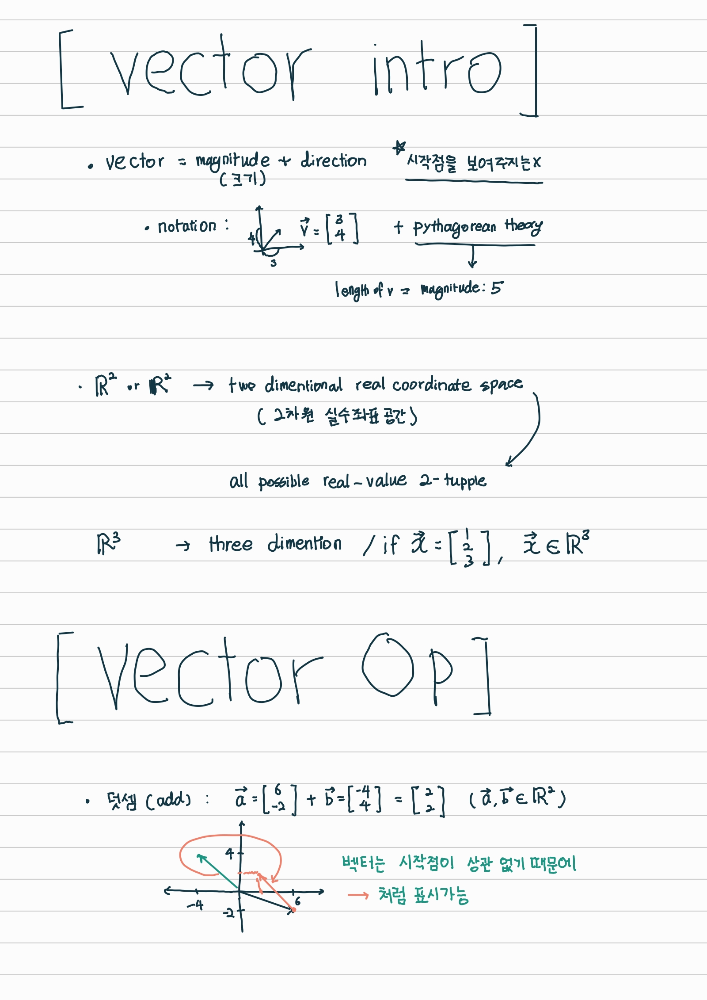
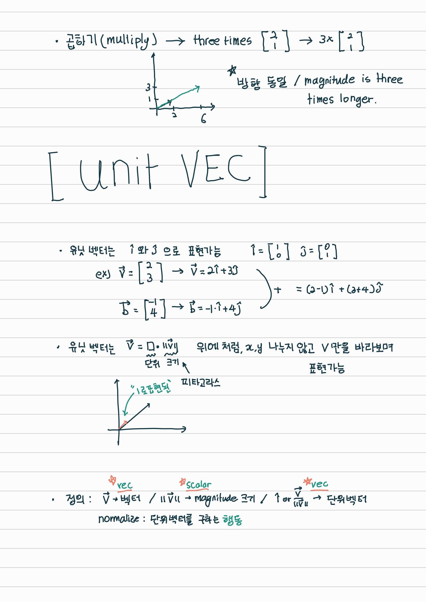
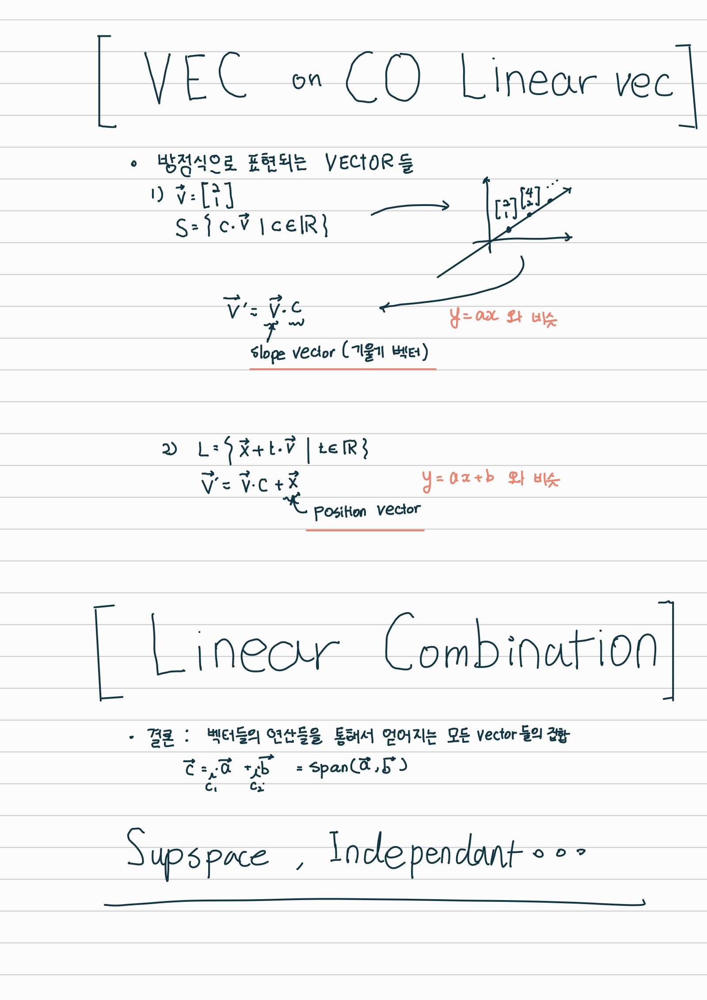
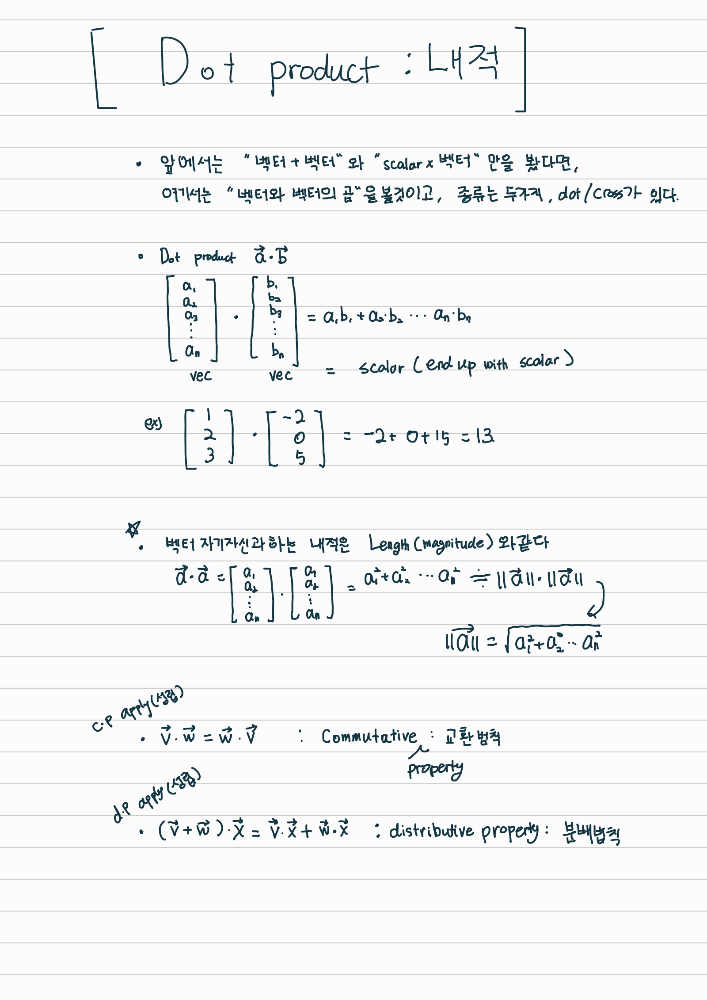
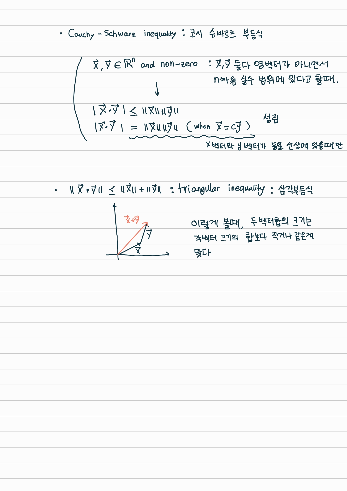
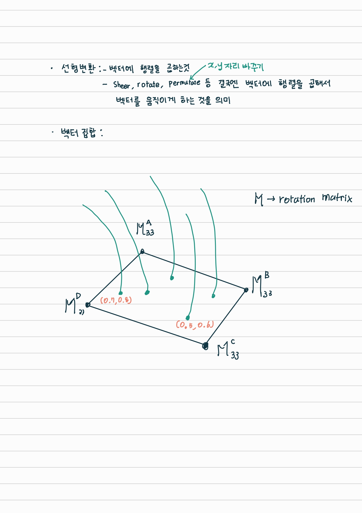


### Transformation Matrix between Local frame and global frame

#### Definition

| Term | Definition | 비유 |
| ---- | ---------- | ---- |
| Local Frame | '객체 자신'을 기준으로 한 공간 | 무대 / 공간 |
| Globla Frame | '전체 세상'을 기준으로 한 공간 | 무대 / 공간 |
| Column Vector | 공간 안에 있는 특정한 '점(Point)의 위치'나 '방향(Direction)'을 담고 있는 순수한 데이터 묶음입니다. | 주어 / 대상 |
| Transformation Matrix | 어떤 벡터를 A 공간에서 B 공간으로 번역(변환)해 주는 '규칙(다리)'입니다 | 동사 / 다리 | 

#### Relationship 
- Transformation Matrix 는 세 개의 column vector (TBN)로 구성되있다.
- 기본적으로, $P_{local}$ X $M_{local}$ = $P_{global}$ 라는 식으로 존재. 
    - Meaning : local frame (좌표계) 상에서의 값(vector)이 $M_{local}$ 을 통해서 global frame (좌표계) 상의 값으로 되었다.
- global frame은 이미 1,0,0 / 0,1,0 / 0,0,1 로 정의되어있음 by default
- Use case - hair deformation
    1. a vetor in global frame (cur_p - root_p)에 $M_{local at rest root point}^{-1}$ 을 곱하면, 해당 local frame of Rest root point 에서 의 값으로 표현됨. 이를 $V_{local of rest}$ 라고 하자.
    2. 그 후 해당 값에 $M_{local of Anim}$ 을 곱하면 local frame (anim) 에서의 값으로 이동한다. 이를 $V_{local Anim}$ 라고 표현. 즉 Local Rest 에서의 벡터 크기가 유지되면서 Local Anim에서의 벡터 크기로 표현.
    3. In the meanwhile, Get **an interpolated root point** at **animated mesh**.
    4. interpolated_p에 $V_{local Anim}$ 을 더하면 global 상의 값으로 됨.

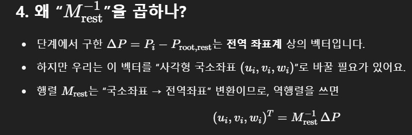

#### How to get the transform matrix which transform local frame into global frame
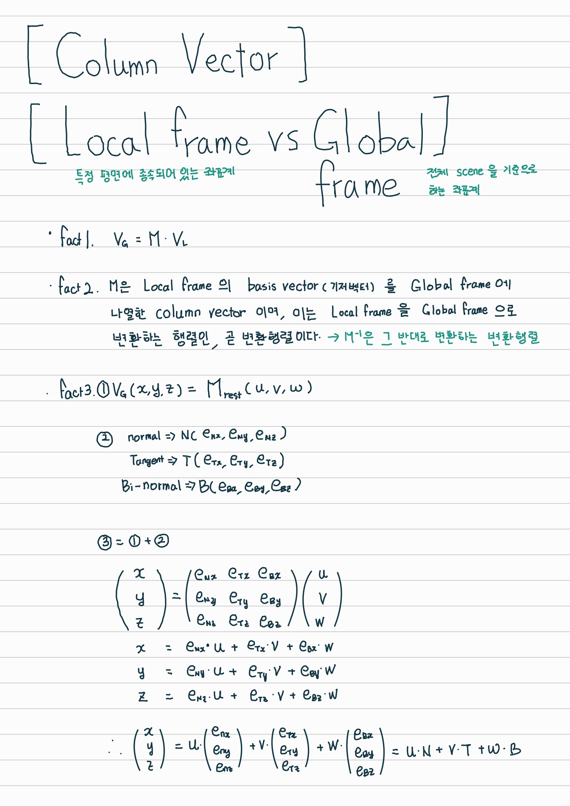


> [!NOTE] TRS vs TBN - transform matrix
> 결론부터 말씀드리면, **두 가지 모두 결과적으로 똑같은 '변환 행렬(Transformation Matrix)'을 만들어내는 방법**입니다. 하지만 **행렬을 조립하는 '관점'과 '재료'가 다릅니다.**
> 1. TRS 방식 (명령어 / 레시피 방식) : 앞서 설명한 방식으로, 우리가 물체를 조작할 때 가장 직관적으로 생각하는 방식입니다.
> - **재료:** 크기(스칼라 값), 회전각(각도, 예를 들어 "Y축으로 45도"), 이동 거리(좌표값)
> - **관점:** **"어떻게 움직일 것인가?" (명령형)**
>   - "크기를 2배로 키우고(S), Z축으로 30도 돌린 다음(R), 앞으로 5칸 가라(T)."
> - **특징:** 인간이 입력하기엔 직관적이지만, 컴퓨터는 이 각도(Degree/Radian)를 행렬로 바꾸기 위해 내부적으로 복잡한 삼각함수($\sin, \cos$) 계산을 거쳐야 합니다.
> 2. T, N, B 방식 (상태 / 나침반 방식)
> - T, N, B는 각각 **Tangent(접선/앞), Normal(법선/위), Binormal(종법선/오른쪽)**을 의미하는 세 개의 방향 벡터(Vector)입니다. 이 세 벡터는 서로 직각(직교)을 이루며 **Local Frame의 X, Y, Z 축** 역할을 합니다.
> - **재료:** 객체의 '오른쪽 방향(X)', '위쪽 방향(Y)', '앞쪽 방향(Z)'을 가리키는 3개의 벡터와, '현재 위치'를 나타내는 1개의 점(Point).
> - **관점:** **"현재 어떤 자세로 어디에 있는가?" (상태형)**
>   - *   "이 물체의 앞(Tangent)은 (0, 0, 1) 방향이고, 위(Normal)는 (0, 1, 0) 방향이며, 오른쪽(Binormal)은 (1, 0, 0)이다. 위치는 (5, 0, 0)이다."
> - **특징:** 각도나 삼각함수 계산 없이, **벡터들을 행렬의 빈칸에 꽂아 넣기만 하면 즉시 변환 행렬이 완성**됩니다.


##### 결론 : 💡 가장 중요한 "아하!" 포인트: 행렬의 진짜 모습

사실, TRS 방식에서 회전(Rotation) 행렬 $R$을 힘들게 $\sin, \cos$으로 계산하고 나면, **그 완성된 $R$ 행렬의 세로줄(Column) 3개가 바로 T, N, B 벡터입니다.**

T, N, B 벡터와 위치 벡터($P$)를 안다면, 곱셈이나 삼각함수 없이 4x4 변환 행렬을 레고 조립하듯 바로 꽂아서 만들 수 있습니다. (※ 그래픽스 API의 축 규약에 따라 T,N,B가 들어가는 순서(X,Y,Z)는 조금씩 다를 수 있습니다.)

$$
\text{Transformation Matrix} = 
\begin{bmatrix}
B_x & N_x & T_x & P_x \\
B_y & N_y & T_y & P_y \\
B_z & N_z & T_z & P_z \\
0 & 0 & 0 & 1
\end{bmatrix}
\begin{array}{l}
\leftarrow \text{오른쪽(X축) 벡터} \\
\leftarrow \text{위쪽(Y축) 벡터} \\
\leftarrow \text{앞쪽(Z축) 벡터} \\
\leftarrow \text{위치(이동) 벡터}
\end{array}
$$

*(위 행렬에서 1,2,3열이 회전(자세)을 담당하고, 4열이 이동(Translation)을 담당합니다.)*


##### 각각 언제 사용할까요? (실전 활용)

**1. TRS를 쓸 때 (물체 배치)**
*   게임 엔진(Maya, Blender, Unity 등)의 Inspector 창에서 캐릭터의 위치, 회전, 크기를 숫자로 직접 조절할 때. 인간은 "오른쪽 벡터가 (0.7, 0.7, 0)이 되게 해줘"라고 생각하지 못하니까요.

**2. T, N, B를 쓸 때 (동적 계산)**
*   **카메라 LookAt 기능:** 카메라가 특정 물체를 바라보게 할 때, '카메라에서 물체를 향하는 벡터(앞)', '하늘 방향 벡터(위)', 두 개를 외적(Cross Product)해서 '오른쪽' 벡터를 구한 뒤 행렬에 꽂아 넣습니다. 각도를 계산할 필요가 없습니다.
*   **롤러코스터 / 곡선 이동 (Spline):** 롤러코스터가 레일을 따라갈 때, 곡선의 진행 방향(Tangent)과 레일의 위쪽(Normal)을 이용해 롤러코스터의 Local Frame(자세)을 매 프레임 즉각적으로 계산합니다.
*   **노멀 맵핑 (Normal Mapping):** 3D 모델의 표면 굴곡을 빛과 계산할 때, 폴리곤 표면의 Local 공간을 정의하기 위해 **Tangent Space(접선 공간)**라는 것을 만들며, 이때 T, N, B 벡터가 필수적으로 사용됩니다.

##### **요약하자면:**
TRS는 우리가 모델을 조작하기 위한 **"핸들과 액셀러레이터"**라면, T,N,B는 공간 상의 절대적인 자세를 정의하는 **"나침반과 GPS 좌표"**라고 이해하시면 그래픽스를 구현하실 때 훨씬 명확하게 접근하실 수 있을 것입니다!

#### C++ function to get the matrix


---

### barycentric interpolation (무게중심)
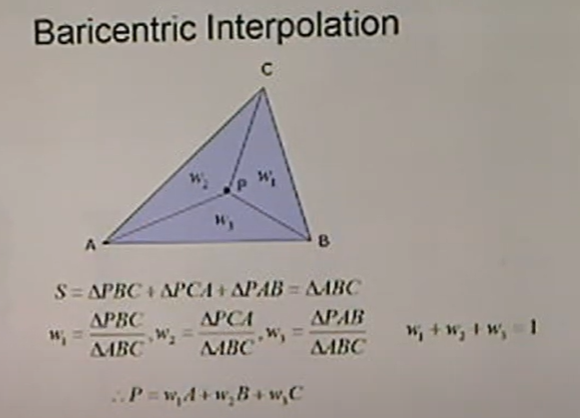
- using this formula, we can get interpolated point P based on three point information.
- for example, we can get interpolated color of points which are in triangle.
  - 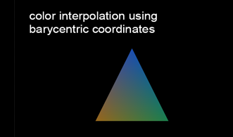

---

## Use Cases
- The part is to know how mathmatics and computer graphics knowledge can be used.

### GuideDeform logic in Houdini  - for SKIN type deformation 01

#### Main Logic

using interloated Translate / Rest points / Rotation (quanternion)

1. Let's assume that every point of mesh is moved when it is animated. if so, we can define how they move using rest position / tralate information / rotate information (quaternion)

2. Define translate / rest / rotate information
   - To define how they translate, we will use substration between moved point and rest point.
   - To define rest position, we will store points of rest mesh
   - To define how they rotate, we will use three kinds of vector ( surface normal vector/ bi-normal vector / tangent vector ) and quaternion

3. based on translate / rest / rotate information of meshes, we will get translate / rest / rotate information of root point of strand by using skinprinuv, skinprim and barycentric interpolation

4. And at last, we can get exact point position using interpoated information ( translate / rest / rotate )


### Transformation Matrix - for SKIN type deformation 02

Transformation Matrix between local frame and global frame 

#### Main Logic
1. a vetor in global frame (cur_p - root_p)에 $M_{local at rest root point}^{-1}$ 을 곱하면, 해당 local frame of Rest root point 에서 의 값으로 표현됨. 이를 $V_{local of rest}$ 라고 하자.
2. 그 후 해당 값에 $M_{local of Anim}$ 을 곱하면 local frame (anim) 에서의 값으로 이동한다. 이를 $V_{local Anim}$ 라고 표현. 즉 Local Rest 에서의 벡터 크기가 유지되면서 Local Anim에서의 벡터 크기로 표현.
3. In the meanwhile, Get **an interpolated root point** at **animated mesh**.
4. interpolated_p에 $V_{local Anim}$ 을 더하면 global 상의 값으로 됨.

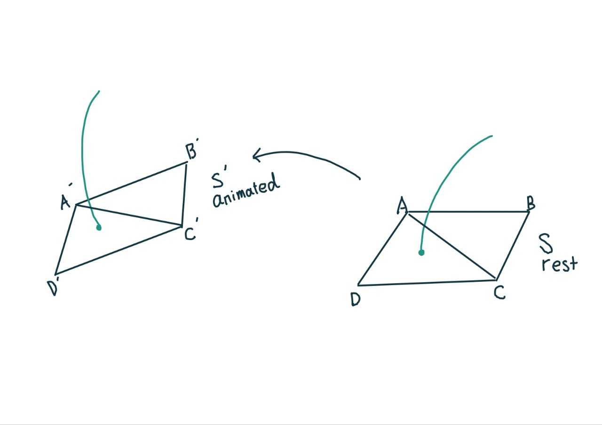

#### Investigations with AI

- Gloabl to local A, and then local A to local B, and then local B to Global

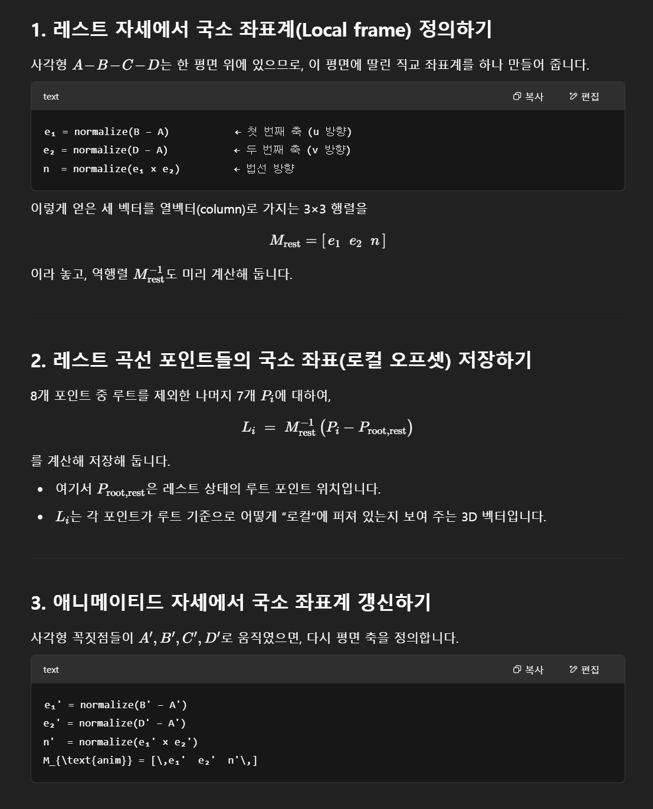
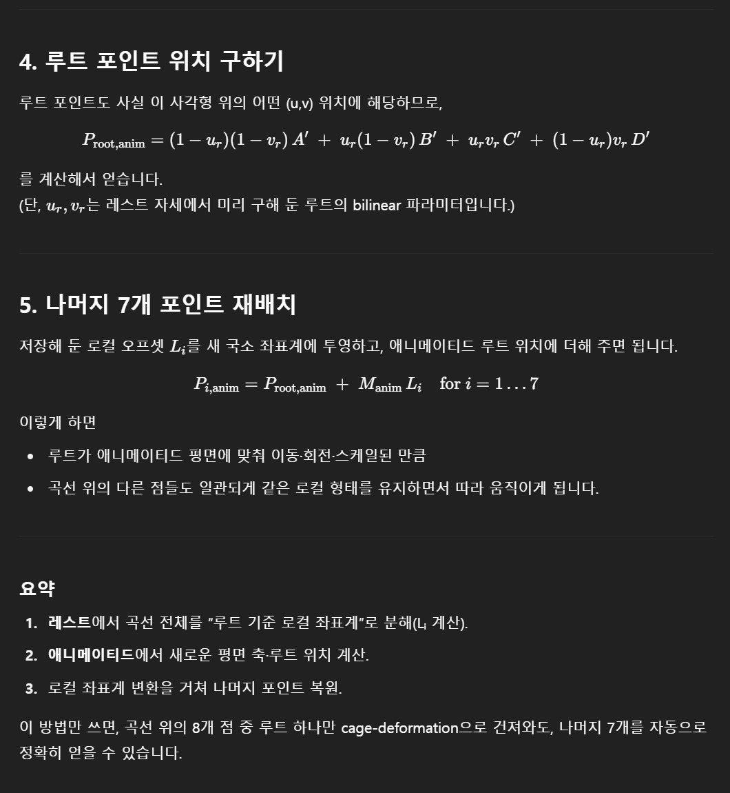

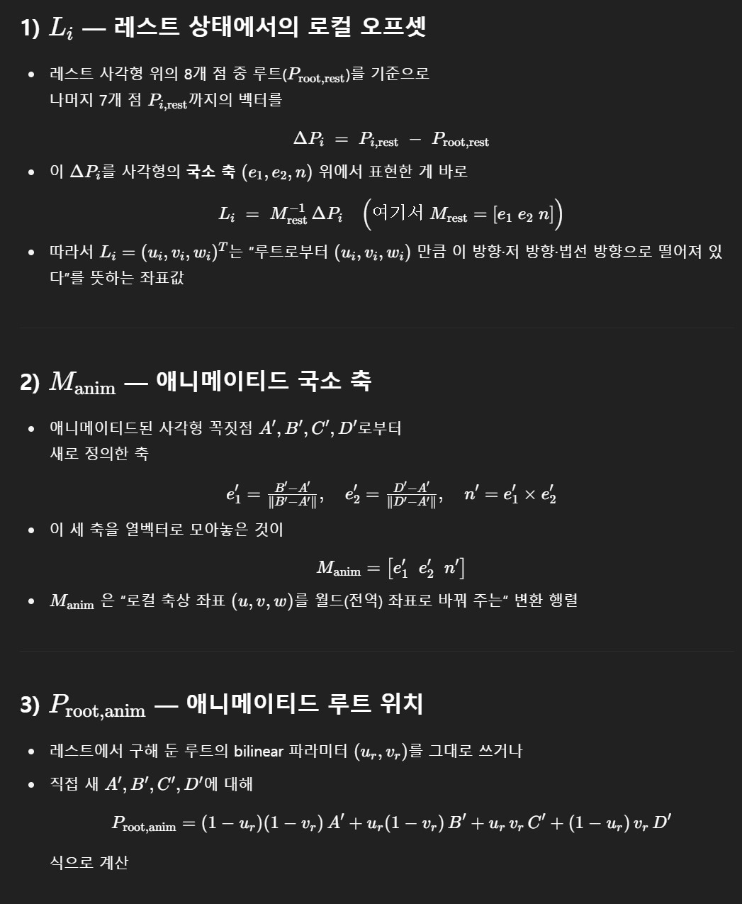
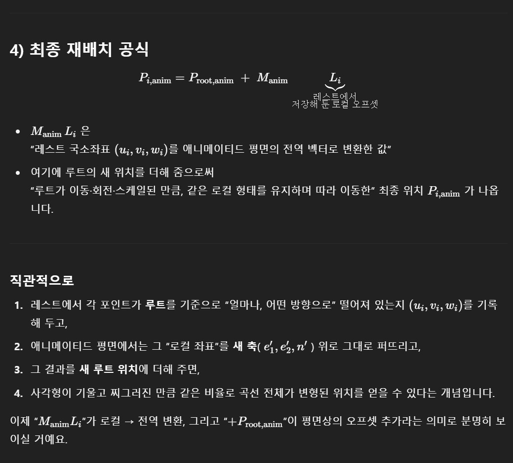

### Bilinear Interpolation - for SKIN type hair deformation
Utilize the algorithm to get a `interpolated root point` at `animated mesh`

- [using Bilinear Interpolation](https://atonlee.tistory.com/52)
- refer to skinprimuv coordinate information.

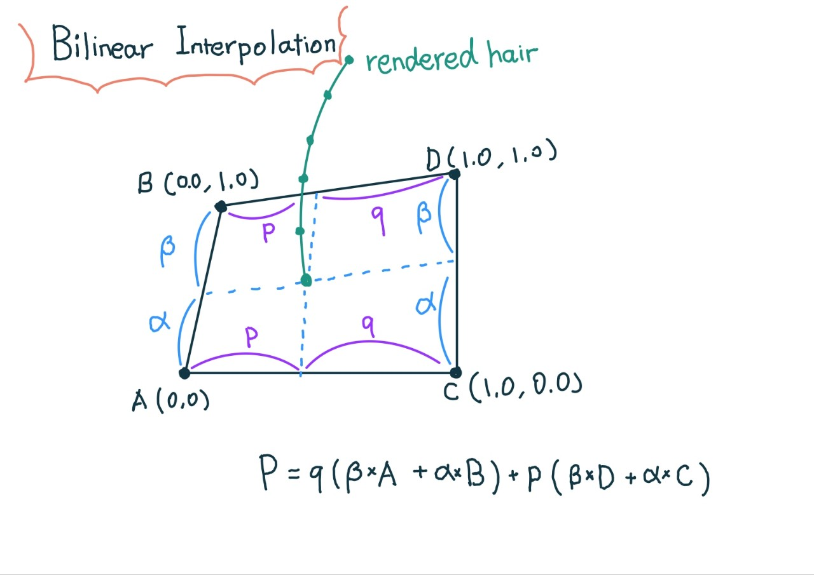


### Barycentric interpolation - for GUIDE type hair/fur deformation

- main principle : Interpolate information of three points which are in simulated guides. if we interpolate information, we can get point position of rendered hair.

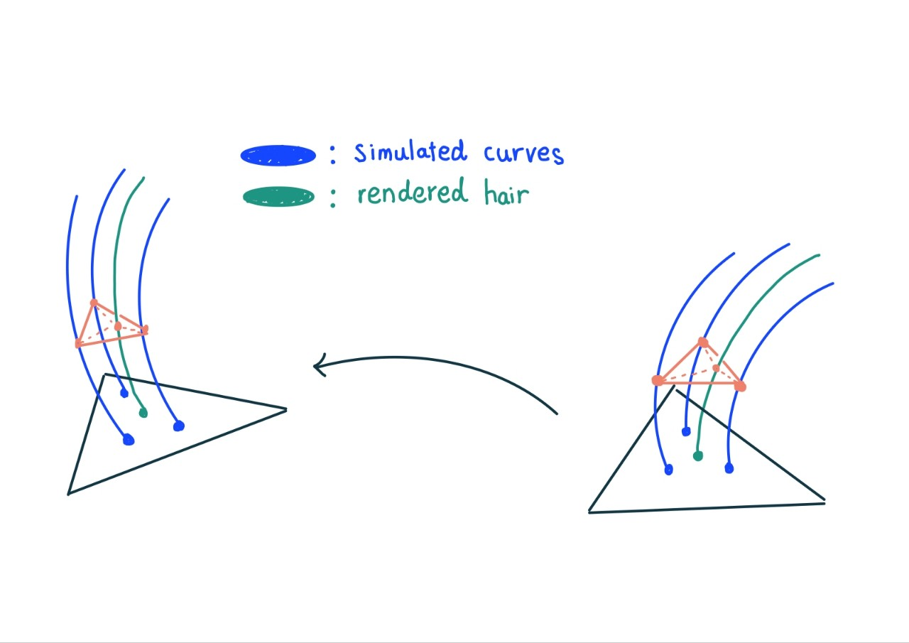


### Tweak hair ( length )
- main principle : Let's assume that one strand is consist of several points and edges. if so, we can know x,y,z information of each point. In this situation, if we subtract one point from another point, it gives you vector. then if we multiply the vector by a scalar magnitude which you want to put in as a length, the result is legnth that we mean to get.
