## Math

### Deviation (편차)
- Definition : this is a expression that represent how much something is far from baseline / average.

### Perpendicular & Cross section
- ex) between the unit vector perpendicular to the cross section and the tangent to the centre line
- Explanation :
    ```
          단면
   -----------
  |           |
  |           |
  |    ●------|-----> 중심선의 접선 벡터
  |           |       (Tangent to the centre line)
  |           |
   -----------
        |
        |
       \|/
  단면에 수직인 단위 벡터
(Unit vector perpendicular to the cross section)

    ```

### Perpendicular & Orthogonal
- Definition : they are same meaning. 90 &deg;
- Comparision : 
    - Perpendicular : normally used in Geometry
    - Orthogonal : normally used in lineary algebra (vector space)
- Use case:
    - Orthonormal : this is a relationship between two vectors. so if the two vector

### Surface normal
- [Surface normal docs link](https://courses.washington.edu/arch481/1.Tapestry%20Reader/1.3D%20Data/5.Surface%20Normals/0.default.html)
- Definition : this is a vector which is pointing perpendicular to the surface
- How to calculate : 
    1. defince surface which is composed of four or three edges
    2. get two vectors from the edges and the two vector are connected
    3. **calculate cross-product of the two vector, then the resulting vector is surface normal**

### 정규직교기저(orthonormal basis) + 선형결합

axis와 side는 서로 수직(2번 질문에서 확인한 외적 관계)이고, 길이가 1인(정규화된) 벡터입니다. 수학적으로 이런 두 벡터를 **정규직교기저(orthonormal basis)**라고 부릅니다 — 2D 평면 하나를 완전히 표현할 수 있는 "좌표축 두 개"인 셈입니다.

선형대수의 기본 정리: 어떤 벡터공간의 기저 {e1, e2}가 있으면, 그 평면 안의 모든 벡터 v는

v = c1·e1 + c2·e2

라는 형태로, 딱 하나의 방식으로 표현됩니다. 여기서 c1, c2는 "그 벡터가 각 축 방향으로 얼마나 있는지"를 나타내는 **좌표(coordinate)**입니다.

지금 코드에 그대로 대입하면:
dir_raw = 0.5·axis + 0.8·side
이건 정확히 "axis-side 평면 위에서, axis축 좌표가 0.5, side축 좌표가 0.8인 점(벡터)을 찍은 것" — 여러분이 학교에서 배운 v = x·i + y·j (i, j는 x축/y축 단위벡터)와 완전히 같은 구조입니다. 단지 i, j 대신 axis, side를 축으로 쓴 것뿐입니다.

normalize가 하는 일: 좌표 → 각도

axis와 side가 서로 수직인 단위벡터이기 때문에, 이 평면은 사실상 일반적인 2D 직교좌표계와 동일합니다. 그래서 계수 (0.5, 0.8)은 극좌표(polar coordinate)의 각도와 바로 연결됩니다:

길이  = sqrt(0.5² + 0.8²) = sqrt(0.89) ≈ 0.943
각도  = atan2(0.8, 0.5)   ≈ 58°   (axis로부터 side 쪽으로 58도 기울어짐)

normalize()는 이 길이(0.943)를 1로 만들 뿐, 각도는 그대로 보존합니다. 그래서 "0.5와 0.8 각각의 절댓값은 의미 없고 비율(=각도)만 중요하다"고 말씀드린 것의 수학적 근거가 바로 이겁니다 — (0.5, 0.8)이든 (5, 8)이든 atan2 값이 같으므로 정규화 후 방향이 똑같습니다.

#### 예시, axis*0.5 + side*0.8을 하는가

이 줄은 나선의 첫 세그먼트가 어느 방향을 보고 출발할지를 정하는 것뿐입니다. axis와 side는 서로 수직인 두 개의 "기준 축"이라고 생각하면, 이건 딱 2D 좌표평면에서 (x, y) = (0.8, 0.5)인 점을 찍는 것과 같은 원리입니다 — 단지 그 평면이 side축과 axis축으로 이루어진 평면일 뿐입니다.

axis (표면 노멀 방향, 위쪽)
  ↑
  |   ↗ axis*0.5 + side*0.8  (이 방향으로 첫 세그먼트가 뻗어나감)
  |  ╱
  | ╱
  |╱ 각도 ≈ atan2(0.8, 0.5) ≈ 58°
  +──────────→ side (표면에 수평인 방향)

- axis 계수(0.5)가 크면 클수록 → 첫 세그먼트가 표면에서 수직으로 곧게 시작
- side 계수(0.8)가 크면 클수록 → 첫 세그먼트가 표면을 따라 옆으로 눕듯이 시작

지금 0.5:0.8 비율은 "완전히 수직도 아니고 완전히 눕지도 않은, 대각선으로 비스듬히 출발"하는 정도를 만든 것 — 돼지꼬리가 뿌리에서부터 비스듬히 말려 올라가는 느낌을 내려고 임의로 고른 값입니다. 물리적으로 정해진 값이 아니라 취향껏 튜닝하는 상수입니다.

### Frenet-Serret formula
- Definition : this is a formula that represent how exact point (particle) move along curve using Normal (N) / Tangent (T) / Bi-normal (B)
- Use case
    - because it isn't for represent one object, it isn't good to be used in calculating object stuff.
    - it is good for calculating movement of point


---

> [!NOTE] Bi-normal vs Bi-tangent: 무엇이 맞을까?
> - **수학(미분기하학)적 정의: Binormal**
    *   수학에서 곡선을 다룰 때 사용하는 **Frenet-Serret 프레임**에서는 $T$(Tangent), $N$(Normal), $B$(Binormal)라는 용어를 사용합니다. 여기서 $B$는 $T$와 $N$에 수직인 벡터를 뜻합니다.
> - **컴퓨터 그래픽스(표면)적 정의: Bitangent**
    *   우리는 보통 평면(Surface) 위에서 작업을 합니다. 표면 위에는 $N$(표면에서 수직으로 솟은 벡터)이 있고, 그 표면에 접하는 $T$(접선)가 있습니다. 이때 **표면에 접하면서 $T$와도 수직인 또 다른 접선**을 의미하기 때문에, "두 번째 접선"이라는 뜻의 **Bitangent**가 의미상 더 정확합니다.
> - **현실적인 상황:**
    *   대부분의 그래픽스 API(DirectX, OpenGL)나 셰이더 코드에서는 관습적으로 $B$를 **Binormal**이라고 부르는 경우가 훨씬 많습니다. 하지만 기술 문서나 엄밀한 논문에서는 **Bitangent**로 정정해서 부르는 추세입니다.
    *   **결론:** 대화할 때는 무엇을 써도 다 알아듣지만, 직접 코드를 짜거나 엔진(Houdini, Katana 등) 내부 데이터를 다룰 때는 해당 툴이 무엇으로 부르는지 확인만 하시면 됩니다. (보통 $B$로 축약하므로 큰 문제는 없습니다.)


---

### TBN / Tangent Space - T/B/N 세 가지를 함께 부르는 용어

이 세 벡터($T, B, N$)는 서로 직교하며 하나의 '공간'을 형성합니다. 이를 부르는 명칭은 맥락에 따라 크게 세 가지로 나뉩니다.

#### ① TBN (가장 흔한 표현)
가장 직관적으로 세 벡터의 앞글자를 따서 **TBN**이라고 부릅니다. 
*   예: "이 셰이더에 **TBN Matrix**가 제대로 계산되었나요?", "**TBN 공간**으로 좌표를 변환해야 합니다."

#### ② 접선 공간 (Tangent Space)
이 세 벡터가 이루는 국소적인 좌표계(Local Frame) 그 자체를 **Tangent Space**라고 부릅니다.
*   물체의 표면에 딱 달라붙어 있는 공간입니다. 노멀 맵(Normal Map)의 데이터가 저장되는 기준이 바로 이 공간입니다.

#### ③ TBN 프레임 (TBN Frame / Basis)
수학이나 물리 엔진, 또는 파이프라인 TD들 사이에서 공간의 '기준'을 말할 때 **Basis(기저)** 또는 **Frame**이라는 표현을 씁니다.
*   객체의 표면 위 한 점에서의 위치와 방향을 정의하는 기준틀이라는 뜻입니다.

#### Naive TBN 계산의 한계 — 파이프라인 파손 원인 3가지

Groom/Hair 커브를 Blender Geometry Nodes에서 메쉬에 붙일 때, 흔히 사용하는 Cross Product 기반 TBN 공식인 $T = v_2 - v_1$, $N = T \times (v_3 - v_1)$, $B = T \times N$ 은 수학적으로는 평면을 구하는 정석적인 공식이지만, Katana/RenderMan + Houdini 파이프라인과 비교했을 때 다음 세 가지 이유로 결과가 어긋난다.

**1. N의 오차 — Face Normal vs. Smooth (Interpolated) Normal**

Cross Product로 구한 N은 해당 폴리곤이 정확히 바라보는 방향 하나(Faceted Face Normal)이다. 곡면이라도 각 폴리곤을 평평한 유리 조각으로 취급하므로, 커브 뿌리(Root)의 위치에 관계없이 같은 폴리곤 안의 모든 점이 동일한 N을 갖게 된다. 결과적으로 털이 폴리곤 경계마다 계단처럼 꺾인다.

Katana/Houdini 디포머는 커브가 심어진 정확한 위치(Barycentric Coordinate)에 맞춰 주변 Vertex들의 Normal을 부드럽게 보간(Smooth Vertex Normal)한다. 파이프라인 매칭을 위해서는 반드시 보간된 N을 사용해야 한다.

**2. T의 오차 — Edge Direction vs. UV Space Direction**

$v_2 - v_1$을 T로 쓰면, T의 방향이 전적으로 '메쉬 엣지가 흘러가는 방향'과 'Vertex ID 순서'에 의존한다. 엣지 흐름이 불균일하거나 좌우 대칭 구간에서 Vertex ID 순서가 뒤집힌 경우 T 방향이 튀게 되어, 커브 전체가 Normal 축을 중심으로 회전(Twisting)하는 현상이 발생한다.

프로덕션 표준은 **UV Map의 U 방향**을 기준으로 Tangent를 생성한다(MikkTSpace 알고리즘). UV가 펴진 일관된 방향을 T로 삼아야 커브 흐름이 렌더러와 일치한다.

**3. Quad 메쉬의 비평면(Non-Planar) 오차**

Face를 구성하는 4개의 Vertex 중 1, 2, 3번만 사용할 경우, Non-Planar Quad에서 1-2-3이 이루는 평면과 1-3-4가 이루는 평면의 기울기가 달라진다. 커브가 Quad의 어느 삼각형 측에 심어져 있는지에 따라 법선 방향이 미세하게 달라지며, 이 오차가 누적되면 렌더러와의 위치 어긋남으로 이어진다.


### Vector Dot & Cross product (Meaning)
- [docs link](https://blog.naver.com/lavacat94/221514187661)
- Meaning
  1. Dot product :
     - $\vec{A} \cdot \vec{B} = \vert \vec{A} \vert \vert \vec{B} \vert \cos\theta$
     - if result of dot product == 0 : two vectors are in perpendicular
     - if result of dot product >  0 : angle of two vectors is less than 90&deg;
     - if result of dot product <  0 : angle of two vectors is more than 90&deg;
     - if calculate dot product with itself : reuslt is that square of itself
     - if result of dot prouct == $\vert 1 \vert$ : two vectors are parallel
  2. Cross Product :
     - $\vec{A} \times \vec{B} = \vec{A} \vec{B} \sin\theta$
     - result is a vector which is perpendicular to two vectors

### Vector projection
- Meaning : a vector which is align with target vector while maintaining its scale or size.
- **Usages**
  1. **Lighting and Shading**
     - **Diffuse Lighting**: Vector projection is used to calculate how light interacts with surfaces. Specifically, the dot product (which is closely related to projection) of the light direction vector and the surface normal vector is used to determine the intensity of diffuse reflection, which affects how bright or dark a surface appears under a light source.
     - **Specular Reflection**: To calculate the specular highlight, the reflection vector is projected onto the view direction vector, helping determine the shininess and the intensity of the specular highlight on the surface.

  2. **Surface Normals**
      - **Normal Mapping**: Vector projection is used in normal mapping, a technique where surface normals are altered using a texture (normal map) to create the illusion of complex surface details on a flat polygon. The light vector is projected onto the normal vector derived from the normal map to calculate the resulting lighting effects.

  3. **Shadow Calculation**
     - **Shadow Mapping**: When computing shadows, vector projection is used to determine where a shadow will fall on a surface. By projecting the position of a point onto the surface of another object in the direction of the light source, graphics algorithms can determine whether a point is in shadow or illuminated.

  4. **Collision Detection and Physics**
     - **Collision Response**: In physics simulations, vector projection is used to calculate the response of objects after a collision. For example, the velocity vector of a moving object can be projected onto the surface normal of the object it collides with, determining how the object will bounce off.
     - **Sliding Along Surfaces**: When an object slides along a surface, its velocity vector is projected onto the surface to calculate the new direction of movement, preventing it from penetrating the surface.

  5. **Texture Mapping**
     - **Texture Space Projection**: Vector projection is used in texture mapping to project 3D points onto a 2D texture map. This helps in mapping textures accurately onto 3D models by projecting the coordinates of vertices onto the texture space.

  6. **Camera and View Transformations**
     - **View Frustum Culling**: In view frustum culling, vector projection is used to determine whether objects are within the camera’s field of view. By projecting the object's position onto the view direction, it can be determined if the object should be rendered or culled.
     - **Orthographic Projection**: In orthographic projection, points in 3D space are projected onto a 2D plane without perspective distortion. This is used in technical drawing and certain types of games and simulations.

  7. **Ray Tracing**
     - **Ray-Object Intersection**: In ray tracing, vector projection is used to determine where rays (lines representing light or sight) intersect with objects in the scene. This is crucial for rendering scenes with realistic lighting, shadows, and reflections.  

<br/>

- **Example: Diffuse Lighting Calculation**

    In the context of diffuse lighting, consider a light vector $\mathbf{L}$ and a normal vector $\mathbf{N}$ at a surface point:

    - The intensity of the light hitting the surface is proportional to the cosine of the angle between $\mathbf{L}$ and $\mathbf{N}$.
    - This can be calculated using the dot product, which is a form of vector projection:
        - $\text{Intensity} = \max(0, \mathbf{L} \cdot \mathbf{N})$

    Here, $\mathbf{L} \cdot \mathbf{N}$ gives the projection of the light vector onto the normal vector, representing how much of the light is directly hitting the surface.


### Vector

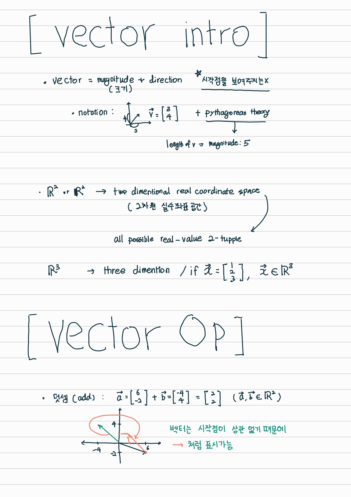
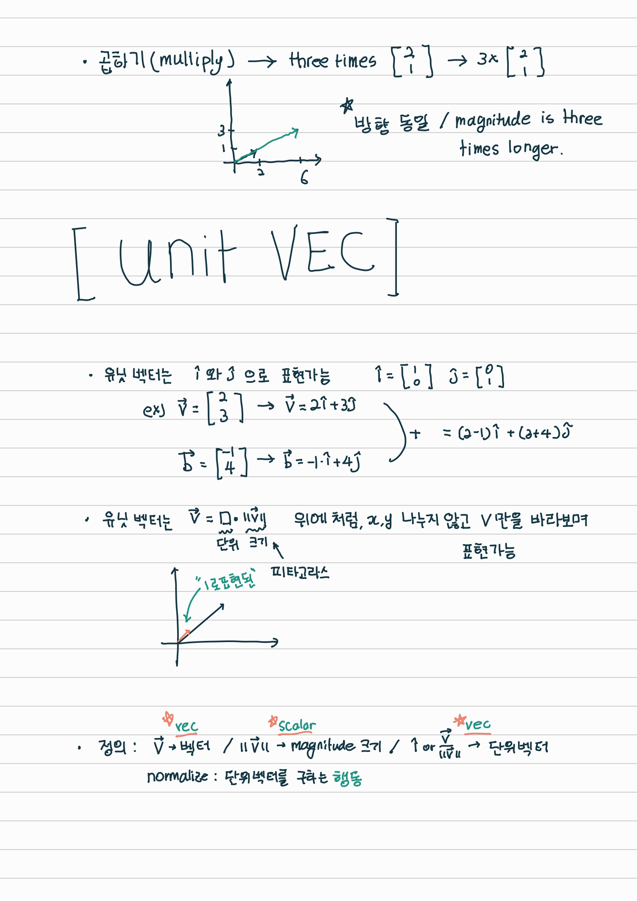
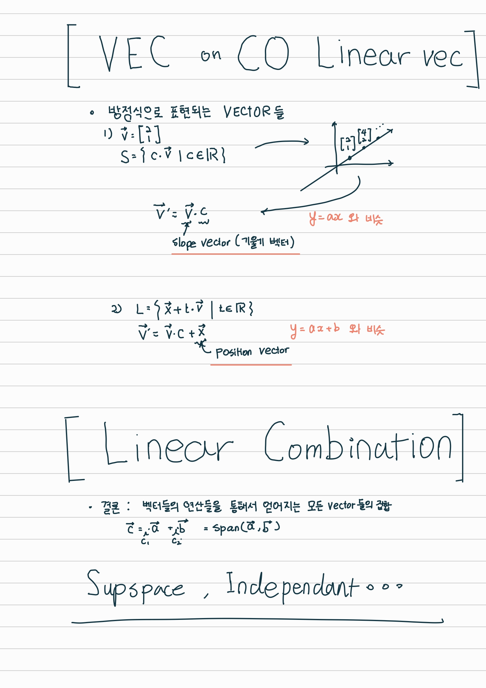
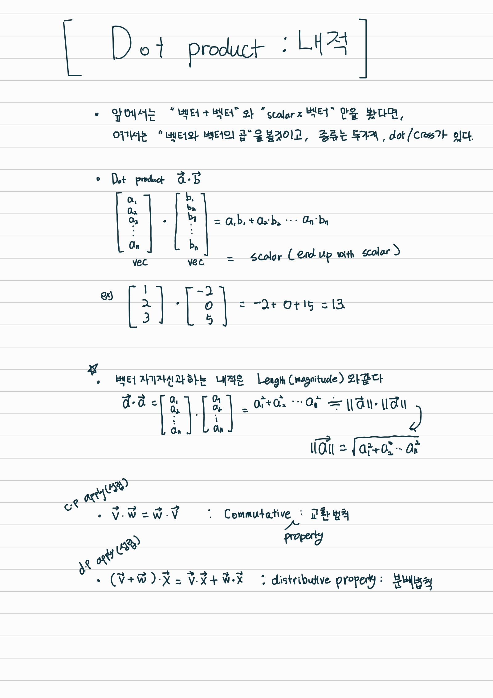
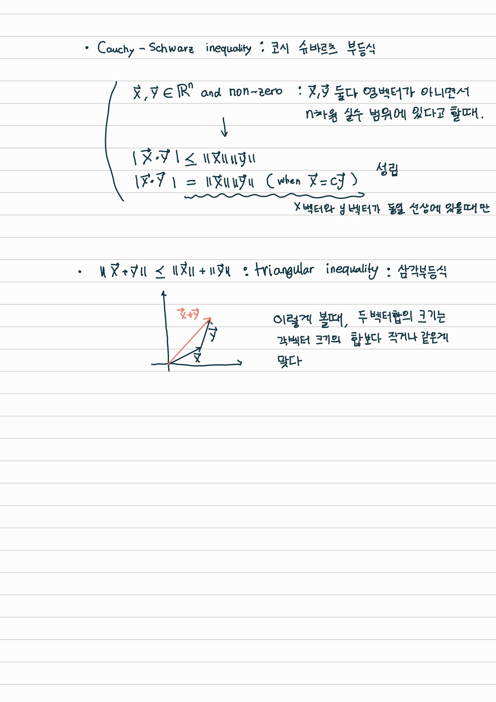
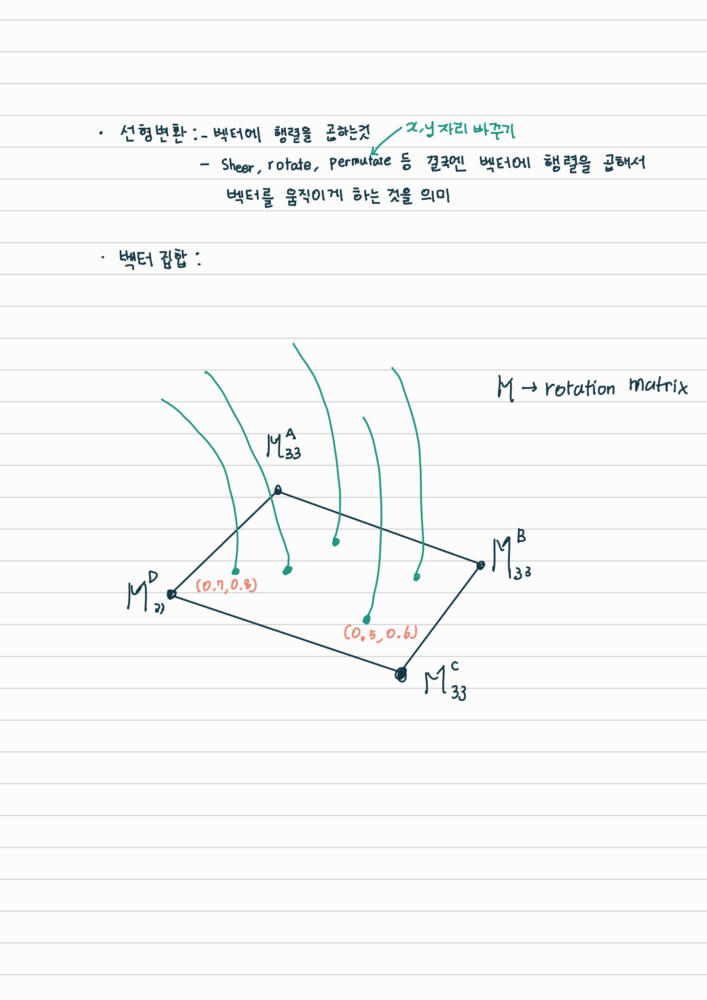


### Transformation Matrix between Local frame and global frame

#### Definition

| Term | Definition | 비유 |
| ---- | ---------- | ---- |
| Local Frame | '객체 자신'을 기준으로 한 공간 | 무대 / 공간 |
| Globla Frame | '전체 세상'을 기준으로 한 공간 | 무대 / 공간 |
| Column Vector | 공간 안에 있는 특정한 '점(Point)의 위치'나 '방향(Direction)'을 담고 있는 순수한 데이터 묶음입니다. | 주어 / 대상 |
| Transformation Matrix | 어떤 벡터를 A 공간에서 B 공간으로 번역(변환)해 주는 '규칙(다리)'입니다 | 동사 / 다리 | 

#### Relationship 
- Transformation Matrix 는 세 개의 column vector (TBN)로 구성되있다.
- 기본적으로, $P_{local}$ X $M_{local}$ = $P_{global}$ 라는 식으로 존재. 
    - Meaning : local frame (좌표계) 상에서의 값(vector)이 $M_{local}$ 을 통해서 global frame (좌표계) 상의 값으로 되었다.
- global frame은 이미 1,0,0 / 0,1,0 / 0,0,1 로 정의되어있음 by default
- Use case - hair deformation
    1. a vetor in global frame (cur_p - root_p)에 $M_{local at rest root point}^{-1}$ 을 곱하면, 해당 local frame of Rest root point 에서 의 값으로 표현됨. 이를 $V_{local of rest}$ 라고 하자.
    2. 그 후 해당 값에 $M_{local of Anim}$ 을 곱하면 local frame (anim) 에서의 값으로 이동한다. 이를 $V_{local Anim}$ 라고 표현. 즉 Local Rest 에서의 벡터 크기가 유지되면서 Local Anim에서의 벡터 크기로 표현.
    3. In the meanwhile, Get **an interpolated root point** at **animated mesh**.
    4. interpolated_p에 $V_{local Anim}$ 을 더하면 global 상의 값으로 됨.

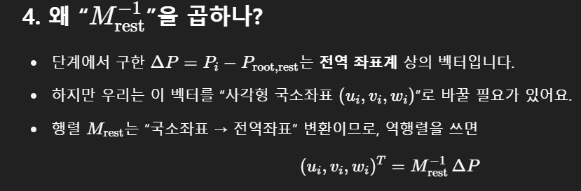

#### How to get the transform matrix which transform local frame into global frame
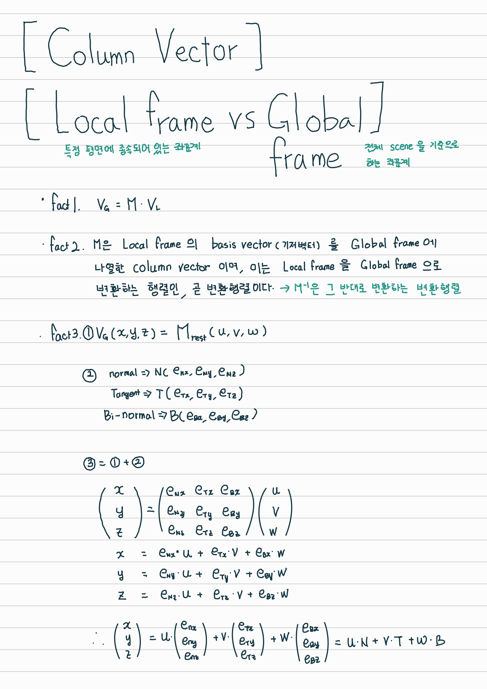


> [!NOTE] TRS vs TBN - transform matrix
> 결론부터 말씀드리면, **두 가지 모두 결과적으로 똑같은 '변환 행렬(Transformation Matrix)'을 만들어내는 방법**입니다. 하지만 **행렬을 조립하는 '관점'과 '재료'가 다릅니다.**
> 1. TRS 방식 (명령어 / 레시피 방식) : 앞서 설명한 방식으로, 우리가 물체를 조작할 때 가장 직관적으로 생각하는 방식입니다.
> - **재료:** 크기(스칼라 값), 회전각(각도, 예를 들어 "Y축으로 45도"), 이동 거리(좌표값)
> - **관점:** **"어떻게 움직일 것인가?" (명령형)**
>   - "크기를 2배로 키우고(S), Z축으로 30도 돌린 다음(R), 앞으로 5칸 가라(T)."
> - **특징:** 인간이 입력하기엔 직관적이지만, 컴퓨터는 이 각도(Degree/Radian)를 행렬로 바꾸기 위해 내부적으로 복잡한 삼각함수($\sin, \cos$) 계산을 거쳐야 합니다.
> 2. T, N, B 방식 (상태 / 나침반 방식)
> - T, N, B는 각각 **Tangent(접선/앞), Normal(법선/위), Binormal(종법선/오른쪽)**을 의미하는 세 개의 방향 벡터(Vector)입니다. 이 세 벡터는 서로 직각(직교)을 이루며 **Local Frame의 X, Y, Z 축** 역할을 합니다.
> - **재료:** 객체의 '오른쪽 방향(X)', '위쪽 방향(Y)', '앞쪽 방향(Z)'을 가리키는 3개의 벡터와, '현재 위치'를 나타내는 1개의 점(Point).
> - **관점:** **"현재 어떤 자세로 어디에 있는가?" (상태형)**
>   - *   "이 물체의 앞(Tangent)은 (0, 0, 1) 방향이고, 위(Normal)는 (0, 1, 0) 방향이며, 오른쪽(Binormal)은 (1, 0, 0)이다. 위치는 (5, 0, 0)이다."
> - **특징:** 각도나 삼각함수 계산 없이, **벡터들을 행렬의 빈칸에 꽂아 넣기만 하면 즉시 변환 행렬이 완성**됩니다.


##### 결론 : 💡 가장 중요한 "아하!" 포인트: 행렬의 진짜 모습

사실, TRS 방식에서 회전(Rotation) 행렬 $R$을 힘들게 $\sin, \cos$으로 계산하고 나면, **그 완성된 $R$ 행렬의 세로줄(Column) 3개가 바로 T, N, B 벡터입니다.**

T, N, B 벡터와 위치 벡터($P$)를 안다면, 곱셈이나 삼각함수 없이 4x4 변환 행렬을 레고 조립하듯 바로 꽂아서 만들 수 있습니다. (※ 그래픽스 API의 축 규약에 따라 T,N,B가 들어가는 순서(X,Y,Z)는 조금씩 다를 수 있습니다.)

$$
\text{Transformation Matrix} = 
\begin{bmatrix}
B_x & N_x & T_x & P_x \\
B_y & N_y & T_y & P_y \\
B_z & N_z & T_z & P_z \\
0 & 0 & 0 & 1
\end{bmatrix}
\begin{array}{l}
\leftarrow \text{오른쪽(X축) 벡터} \\
\leftarrow \text{위쪽(Y축) 벡터} \\
\leftarrow \text{앞쪽(Z축) 벡터} \\
\leftarrow \text{위치(이동) 벡터}
\end{array}
$$

*(위 행렬에서 1,2,3열이 회전(자세)을 담당하고, 4열이 이동(Translation)을 담당합니다.)*


##### 각각 언제 사용할까요? (실전 활용)

**1. TRS를 쓸 때 (물체 배치)**
*   게임 엔진(Maya, Blender, Unity 등)의 Inspector 창에서 캐릭터의 위치, 회전, 크기를 숫자로 직접 조절할 때. 인간은 "오른쪽 벡터가 (0.7, 0.7, 0)이 되게 해줘"라고 생각하지 못하니까요.

**2. T, N, B를 쓸 때 (동적 계산)**
*   **카메라 LookAt 기능:** 카메라가 특정 물체를 바라보게 할 때, '카메라에서 물체를 향하는 벡터(앞)', '하늘 방향 벡터(위)', 두 개를 외적(Cross Product)해서 '오른쪽' 벡터를 구한 뒤 행렬에 꽂아 넣습니다. 각도를 계산할 필요가 없습니다.
*   **롤러코스터 / 곡선 이동 (Spline):** 롤러코스터가 레일을 따라갈 때, 곡선의 진행 방향(Tangent)과 레일의 위쪽(Normal)을 이용해 롤러코스터의 Local Frame(자세)을 매 프레임 즉각적으로 계산합니다.
*   **노멀 맵핑 (Normal Mapping):** 3D 모델의 표면 굴곡을 빛과 계산할 때, 폴리곤 표면의 Local 공간을 정의하기 위해 **Tangent Space(접선 공간)**라는 것을 만들며, 이때 T, N, B 벡터가 필수적으로 사용됩니다.

##### **요약하자면:**
TRS는 우리가 모델을 조작하기 위한 **"핸들과 액셀러레이터"**라면, T,N,B는 공간 상의 절대적인 자세를 정의하는 **"나침반과 GPS 좌표"**라고 이해하시면 그래픽스를 구현하실 때 훨씬 명확하게 접근하실 수 있을 것입니다!

#### C++ function to get the matrix


---

### barycentric interpolation (무게중심)
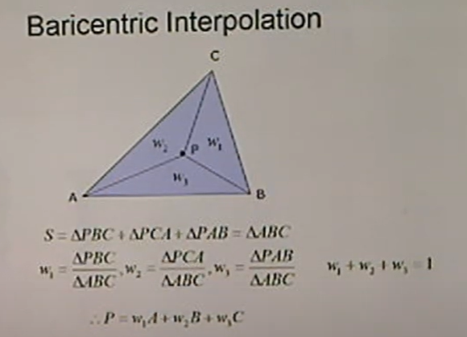
- using this formula, we can get interpolated point P based on three point information.
- for example, we can get interpolated color of points which are in triangle.
  - 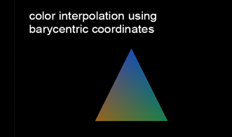


### Quaternion (쿼터니언 / 사원수)

축(vector) + 각도(scalar) 로 축을 기준으로 얼만큼 회전시켜야하는가로, return 값은 4차원 복소수($w, x, y, z$) 데이터. 단, 3x3 행렬, vector형태의 오일러 값으로 변환 가능

* EN: A four-dimensional mathematical representation ($w, x, y, z$) used to calculate smooth, non-linear 3D rotations and orientations without suffering from gimbal lock.
* KO: 짐벌 락(Gimbal Lock) 현상 없이 3D 공간 상에서 부드럽고 유기적인 회전과 오리엔테이션(Orientation)을 연산하기 위해 사용하는 복소수 확장 개념의 4차원 수학적 표현식($w, x, y, z$)입니다. 

#### 상세 설명

'Quaternion'이라는 단어는 라틴어로 '4개씩 짜인 패거리'를 뜻하는 *quaterni*에서 유래했습니다. 수학자 윌리엄 로언 해밀턴이 복소수(Real + Imaginary) 개념을 3차원으로 확장하려다 실패한 뒤, 아예 차원을 하나 더 늘려 하나의 실수와 세 개의 허수 단위($i, j, k$)로 이루어진 4차원 공간의 수 체계를 정립하면서 이 이름이 붙었습니다.

#### 오일러 대신 쓰는 이유

VFX 및 애니메이션 업계에서 쿼터니언이 구세주로 대접받는 이유는 오직 하나, 기존 오일러 각도(Euler Angles: 우리가 흔히 아는 $X, Y, Z$ 회전축)의 고질적인 한계인 짐벌 락(Gimbal Lock)을 완벽하게 회피할 수 있기 때문입니다. 오일러 방식은 세 축을 순차적으로 회전시키다 보니 두 축이 겹치는 순간 차원 하나를 잃고 먹통이 되는 치명적인 문제가 있습니다.

반면 쿼터니언은 3D 공간 상에 하나의 임의의 회전축을 상정하고 그 축을 기준으로 한 번에 회전시키는 구조($w$는 회전량, $x, y, z$는 회전 축 벡터)를 가집니다. 축이 겹칠 일이 아예 없으므로 짐벌 락이 발생하지 않고, 두 각도 사이를 부드럽게 이어주는 구면 선형 보간(SLERP)이 수학적으로 완벽하게 떨어집니다. 다만 아티스트가 그래프 에디터(Graph Editor)에서 $w, x, y, z$ 네 개의 곡선을 직관적으로 조절하기는 불가능에 가깝기 때문에, 주로 엔진의 백엔드 연산이나 파이프라인 데이터 저장용으로 맹활약합니다.

#### 실무 활용 예시 (Use Case)

**상황 1: 리깅(Rigging) 파이프라인 및 애니메이션 베이크(Bake) 툴 개발**
캐릭터의 어깨(Shoulder)나 고관절(Hip)처럼 360도 전 방향으로 격렬하게 회전하는 관절 부위를 셋업할 때입니다. 애니메이터가 캐릭터를 공중제비 돌리거나 격투 액션을 시켰을 때, 오일러 제어 방식은 특정 각도에서 관절이 부자연스럽게 뒤틀리거나 굳어버리는 짐벌 락을 유발합니다.

* **실무 적용:** 리깅 TD들은 관절의 회전 제어 및 트랜스포메이션 행렬을 계산할 때 내부적으로 쿼터니언 구조를 채택합니다. 애니메이션 데이터를 다른 소프트웨어(예: Maya에서 MotionBuilder나 내부 군중 시뮬레이션 툴)로 익스포트하거나 베이크할 때, 각도 데이터를 오일러가 아닌 쿼터니언 속성 값으로 변환하여 굽습니다. 이렇게 하면 데이터 용량도 4x4 행렬에 비해 획기적으로 줄어들고, 이기종 툴 간의 회전 데이터 왜곡 현상을 완벽히 차단할 수 있습니다.

**상황 2: FX 파이프라인의 포인트 인스턴싱 및 오리엔테이션(`@orient`) 제어**
후디니(Houdini)나 USD 기반 파이프라인에서 수백만 개의 파편, 나뭇잎, 혹은 그룸(Groom) 가이드 포인트들의 회전 방향을 절차적으로 제어해야 하는 상황입니다.

* **실무 적용:** 포인트에 방향성을 부여할 때 Euler 각도(`@rot`)를 쓰면 보간 과정에서 축이 튀는 현상(Flipping)이 발생합니다. 베테랑 TD들은 포인트 속성으로 4개 컴포넌트를 가진 벡터인 `@orient` 변수를 생성하고 여기에 쿼터니언 값을 주입합니다. 바람에 흔들리는 나뭇잎의 회전이나 물리 시뮬레이션으로 굴러가는 돌멩이의 회전값을 두 프레임 사이에서 보간할 때, `slerp()` 함수를 이용해 쿼터니언 보간을 수행함으로써 화면에서 파편들이 부르르 떨리거나 순간적으로 뒤집히는 비주얼 버그를 깔끔하게 해결합니다.

---

## Use Cases
- The part is to know how mathmatics and computer graphics knowledge can be used.

### GuideDeform logic in Houdini  - for SKIN type deformation 01

#### Main Logic

using interloated Translate / Rest points / Rotation (quanternion)

1. Let's assume that every point of mesh is moved when it is animated. if so, we can define how they move using rest position / tralate information / rotate information (quaternion)

2. Define translate / rest / rotate information
   - To define how they translate, we will use substration between moved point and rest point.
   - To define rest position, we will store points of rest mesh
   - To define how they rotate, we will use three kinds of vector ( surface normal vector/ bi-normal vector / tangent vector ) and quaternion

3. based on translate / rest / rotate information of meshes, we will get translate / rest / rotate information of root point of strand by using skinprinuv, skinprim and barycentric interpolation

4. And at last, we can get exact point position using interpoated information ( translate / rest / rotate )


### Transformation Matrix - for SKIN type deformation 02

Transformation Matrix between local frame and global frame 

#### Main Logic
1. a vetor in global frame (cur_p - root_p)에 $M_{local at rest root point}^{-1}$ 을 곱하면, 해당 local frame of Rest root point 에서 의 값으로 표현됨. 이를 $V_{local of rest}$ 라고 하자.
2. 그 후 해당 값에 $M_{local of Anim}$ 을 곱하면 local frame (anim) 에서의 값으로 이동한다. 이를 $V_{local Anim}$ 라고 표현. 즉 Local Rest 에서의 벡터 크기가 유지되면서 Local Anim에서의 벡터 크기로 표현.
3. In the meanwhile, Get **an interpolated root point** at **animated mesh**.
4. interpolated_p에 $V_{local Anim}$ 을 더하면 global 상의 값으로 됨.

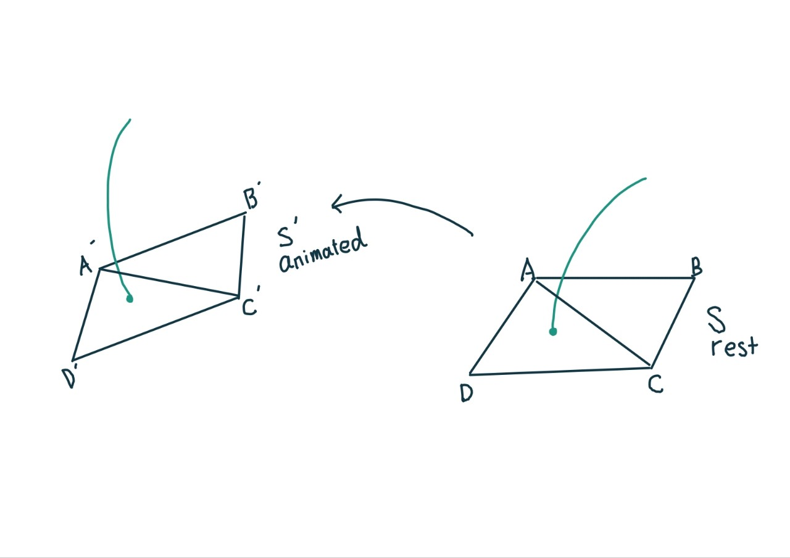

#### Investigations with AI

- Gloabl to local A, and then local A to local B, and then local B to Global

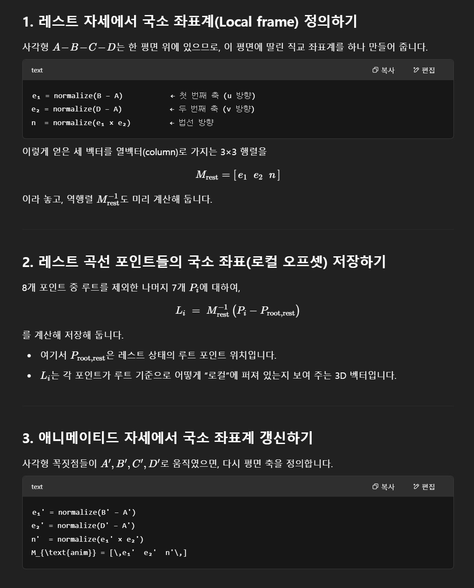
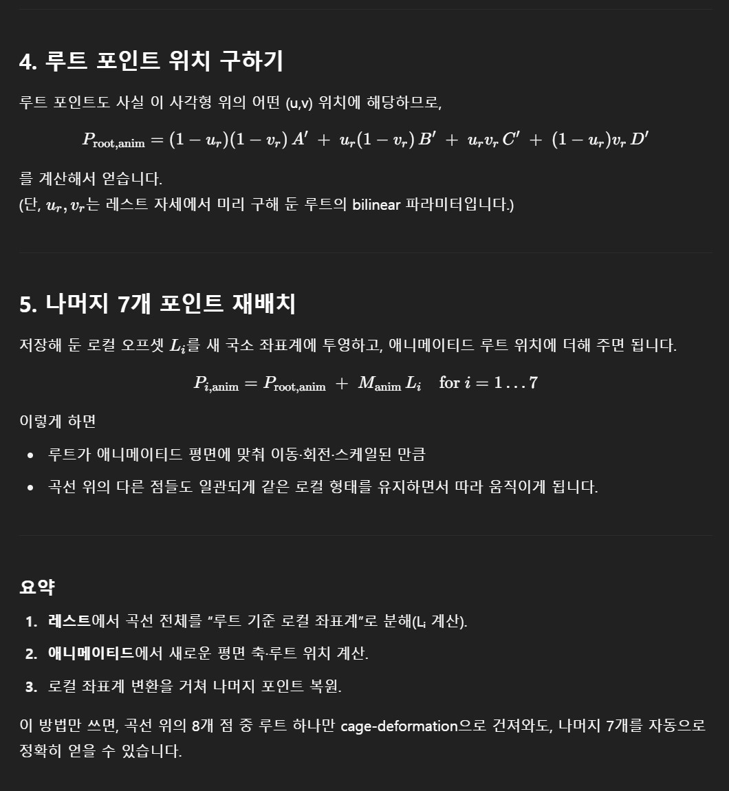

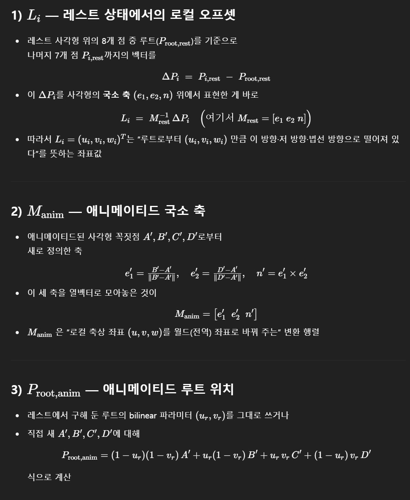
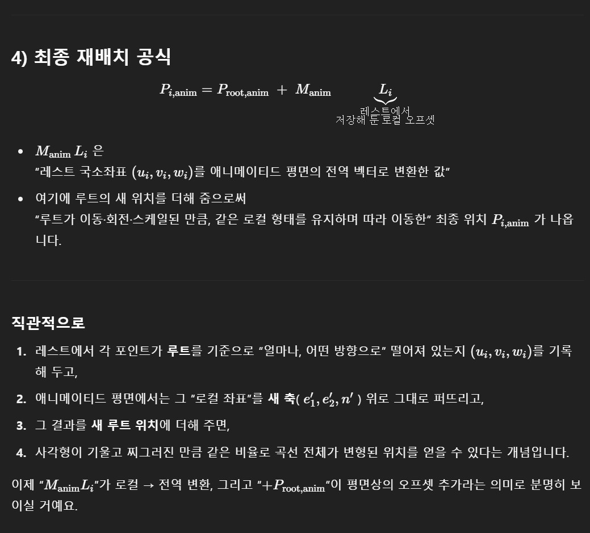

### Bilinear Interpolation - for SKIN type hair deformation
Utilize the algorithm to get a `interpolated root point` at `animated mesh`

- [using Bilinear Interpolation](https://atonlee.tistory.com/52)
- refer to skinprimuv coordinate information.

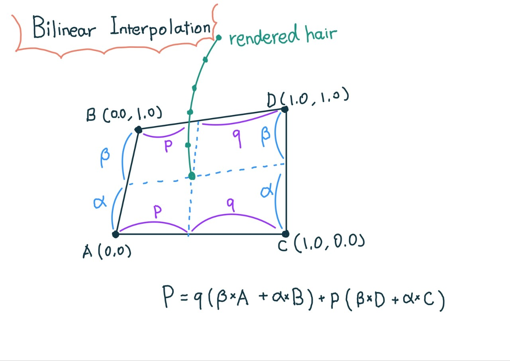


### Barycentric interpolation - for GUIDE type hair/fur deformation

- main principle : Interpolate information of three points which are in simulated guides. if we interpolate information, we can get point position of rendered hair.

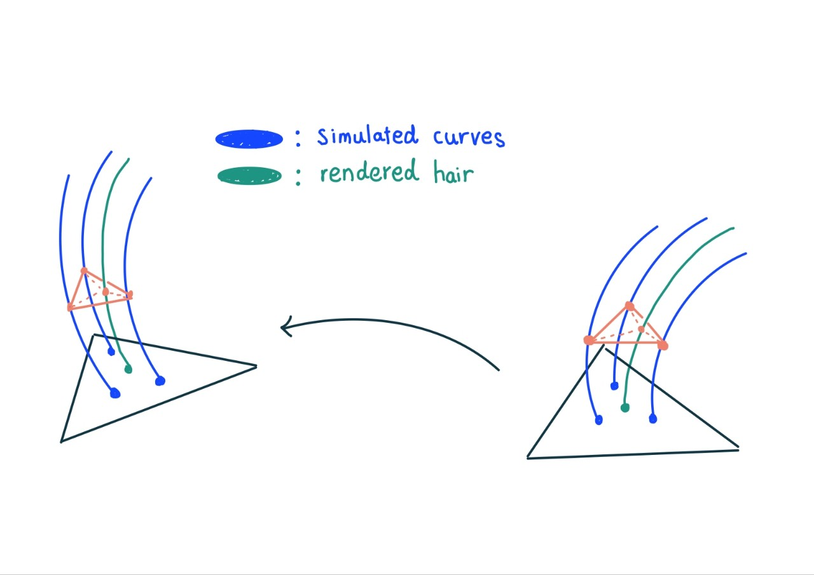


### Blender Geometry Nodes에서 정확한 TBN 추출 — skinprim / skinprimuv 기반

Houdini의 `skinprim`과 `skinprimuv`를 Blender Geometry Nodes에서 재현할 때, TBN을 올바르게 구하려면 먼저 이 값들이 어떤 토폴로지 기준으로 계산되었는지 확인해야 한다.

#### skinprim / skinprimuv의 토폴로지 기준

`xyzdist` 노드(또는 VEX)를 실행할 당시의 타겟 메쉬(Skin) 상태를 그대로 따른다.

| Houdini 메쉬 상태 | `skinprimuv` 해석 |
|---|---|
| **Quad** | 해당 사각형 면 위의 **Bilinear(이중 선형) 좌표** (0.0 ~ 1.0) |
| **Triangle** | 해당 삼각형 면 위의 **Barycentric(무게중심) 좌표** |

> **Quad Trap — 파이프라인 주의 사항**
> Houdini에서 Quad 상태로 `skinprimuv`를 구하면, Blender에서 완벽하게 재구성하는 것은 불가능하다. Blender는 내부적으로 모든 지오메트리 연산에서 Quad를 두 개의 Triangle로 분할(Triangulate)한다. Houdini의 Quad Bilinear 수학과 Blender의 Triangle 분할 수학이 일치하지 않으므로, 커브가 표면에서 미끄러지거나 위치가 어긋난다.
>
> **해결책:** Groom 데이터 추출 전, Houdini에서 베이스 메쉬에 **Divide SOP (Triangulate 체크)** 를 적용하여 모든 면을 삼각형으로 변환한 뒤 `xyzdist`로 `skinprim`과 `skinprimuv`를 구한다. Blender와 Katana 양쪽에 **동일하게 Triangulate된 메쉬**를 전달해야 두 소프트웨어 간 오차율을 0으로 만들 수 있다.

Blender에서의 skinprim/skinprimuv 처리 방식 전반은 [Blender — Houdini skinprim / skinprimuv 데이터를 Geometry Nodes로 처리하기](/pipeline/2026-02-28-blender.html)를 참고한다.

#### Blender Geometry Nodes TBN 보간 노드 셋업

베이스 메쉬가 Triangle으로 통일되어 있다는 전제하에, `skinprim`과 `skinprimuv`를 사용해 Smooth TBN을 구성하는 3단계 노드 설계다.

Houdini 삼각형 `primuv` 수학에서 꼭짓점 0, 1, 2의 가중치는 다음과 같다.

$$W_0 = 1.0 - u - v, \quad W_1 = u, \quad W_2 = v$$

**Step 1 — 꼭짓점 3개의 데이터 추출**

1. `Corners of Face` 노드의 `Face Index` 소켓에 `skinprim` (Named Attribute)을 연결한다. `Sort Index`를 0, 1, 2로 설정한 3개의 노드(또는 복사본)로 Face Corner Index 세 개를 확보한다.
2. `Sample Index` 노드(총 6개)를 `Domain: Point` 또는 `Face Corner`로 설정하고, `Normal` (내장 속성)과 `UV Tangent` (Houdini PolyFrame으로 미리 구워 넘긴 TangentU Attribute)를 각각 샘플링하여 $N_0, N_1, N_2$, $T_0, T_1, T_2$를 얻는다.

**Step 2 — Barycentric 보간 적용**

`skinprimuv` (2D Vector)의 X를 $u$, Y를 $v$로 분리(`Separate XYZ`)한 뒤 가중치를 계산한다.

- $W_1 = u$, $W_2 = v$, $W_0 = 1.0 - (u + v)$

Vector Math (Scale & Add) 노드로 보간한다.

$$N_{smooth} = N_0 \cdot W_0 + N_1 \cdot W_1 + N_2 \cdot W_2$$
$$T_{smooth} = T_0 \cdot W_0 + T_1 \cdot W_1 + T_2 \cdot W_2$$

각각 `Vector Math (Normalize)` 노드로 길이를 1로 정규화한다.

**Step 3 — Gram-Schmidt 직교화**

보간된 $T$와 $N$은 미세하게 90도를 벗어날 수 있다. 안정적인 디폼 매트릭스를 위해 세 벡터가 완벽한 직교를 이루도록 보정한다.

1. `Vector Math (Cross Product)`: $B = N_{smooth} \times T_{smooth}$ — Normalize하여 **B (Bitangent)** 확정. (Houdini Handedness에 따라 $T \times N$ 순서로 조정.)
2. `Vector Math (Cross Product)`: $T_{final} = B \times N_{smooth}$ — Normalize하여 N과 완벽히 90도를 이루는 **T** 재계산.
3. **N**: $N_{smooth}$ 그대로 사용.

이렇게 구한 T, B, N은 Katana/RenderMan 디포머가 내부적으로 구성하는 Local Transform Matrix와 수학적으로 동일한 기준축이다. TBN을 변환 행렬로 조립하는 방법은 [위의 Transformation Matrix 섹션](#transformation-matrix-between-local-frame-and-global-frame)을 참고한다.


### Tweak hair ( length )
- main principle : Let's assume that one strand is consist of several points and edges. if so, we can know x,y,z information of each point. In this situation, if we subtract one point from another point, it gives you vector. then if we multiply the vector by a scalar magnitude which you want to put in as a length, the result is legnth that we mean to get.
