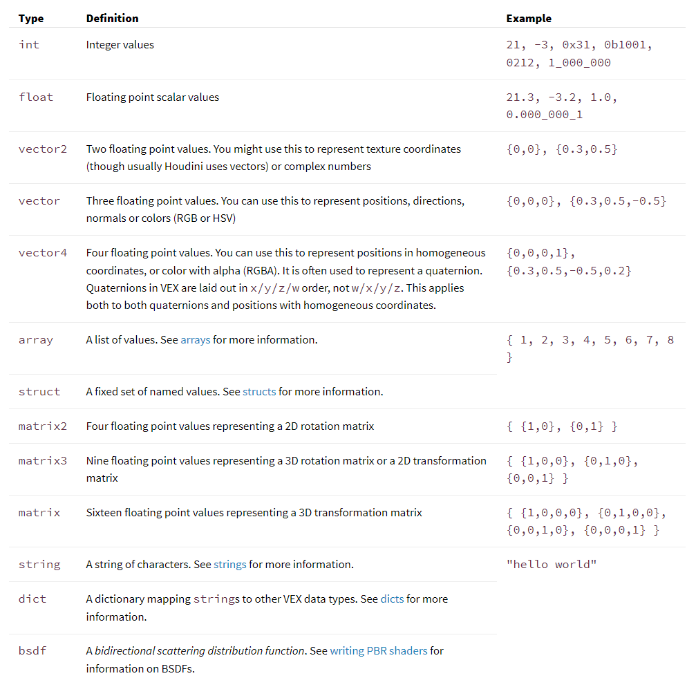
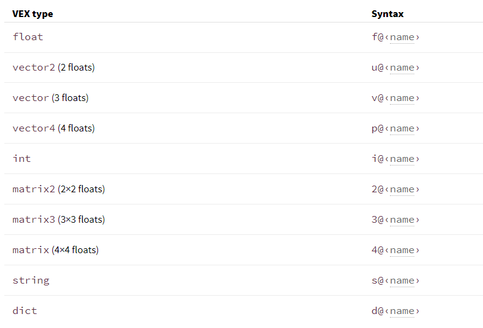
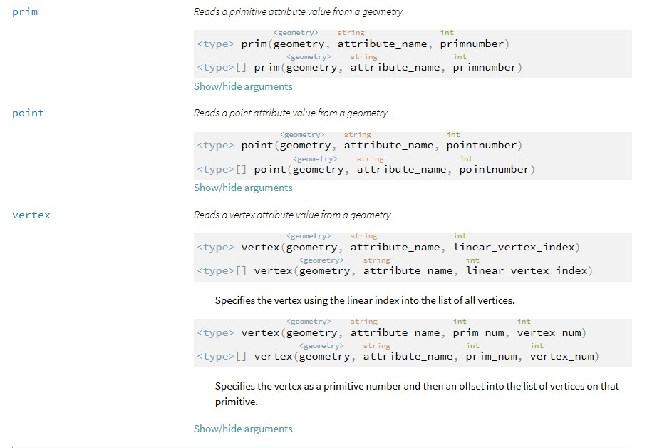
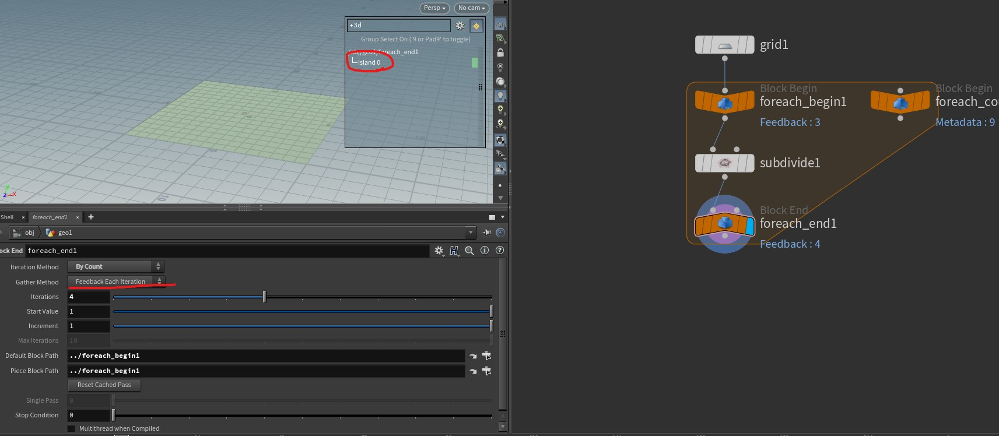
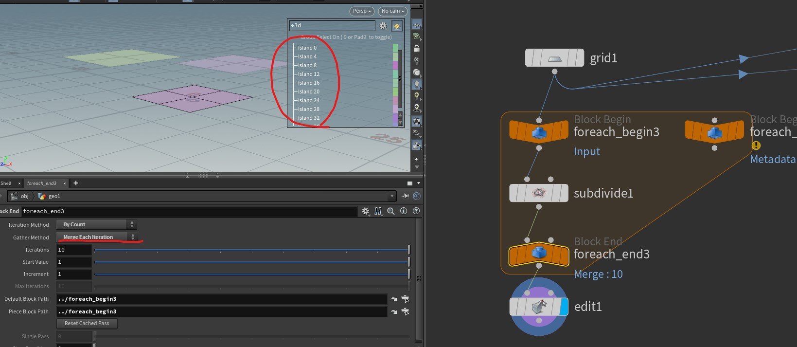
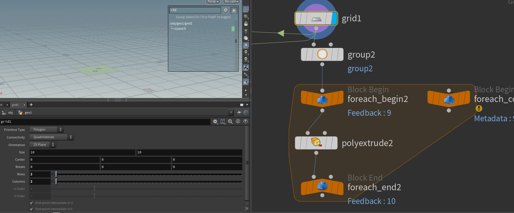
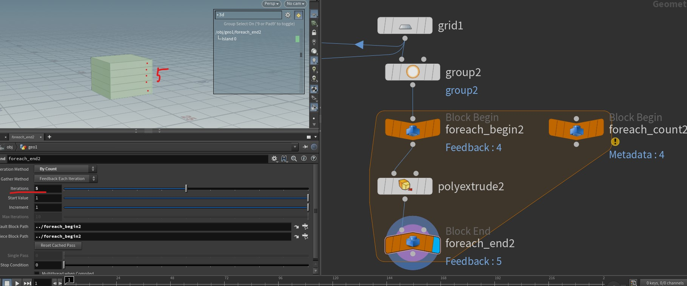

## Resources Links
- [Vex language reference](https://www.sidefx.com/docs/houdini/vex/lang.html#statements)
    - for basic syntax including types and statements
- [Using VEX expressions](https://www.sidefx.com/docs/houdini/vex/snippets.html)
    - further step for how to use.
    - Non-float attributes with known types
        - ex) @P, @N ...
    - Accessing attributes on other inputs
        - ex) v@opinput0_P

- [Vex Cheat Sheet from CGWiki](https://tokeru.com/cgwiki/VexCheatSheet.html)

## Terminology


## Shortcuts
- Align nodes : a + move mouse with L click


## [ Vex & Expression Syntax ] 

### Vex Data types
- [Vex Data types](https://www.sidefx.com/docs/houdini/vex/lang.html#data-types)


### Attribute types
- [Attribute types](https://www.sidefx.com/docs/houdini/vex/snippets.html#attributes)


```
// floats and integers
f@myfloat = 12.234; // float, vex assumes float if you don't specify prefix. Good if you're lazy, bad if you forget and mis-assign things!
i@myint = 5; // integer

// vectors
u@myvector2 = {0.6, 0.5}; // vector2 (2 floats)
v@myvector = {1,2,3}; // vector (3 floats)
p@myquat = {0,0,0,1}; // quaternion / vector4 / 4 floats

// matricies
2@mymatrix2 = {1,2,3,4}; // matrix2 (2x2 floats)
3@mymatrix3 = {1,2,3,4,5,6,7,8,9}; // matrix3 (3x3 floats)
4@mymatrix4 = {1,2,3,4,5,6,7,8,9,10,11,12,13,14,15,16}; // matrix (4x4 floats)

// strings and dictionaries
s@mystring = 'a string'; // string
d@mydict = {}; // dict, can only instantiate as empty type
d@mydict['key'] = 'value'; // can set values once instantiated
```


### Read Attribute
- [Read attribute](https://www.sidefx.com/docs/houdini/vex/attrib_suite.html#attrib)



### Write Attribute
- assign value to @attribute_name

```
...
@attr_name = value; # if the type is not specified here, it mean that it is float
f@attr_name = value;
s@path = replace(tar_path, "this_string", "to_string");
```

### String functions
- [Strings](https://www.sidefx.com/docs/houdini/vex/functions/index.html#string_group)
- Examples
```vex
string str = "abcdef abcdef abcdef";

// Returns "abcghi abcghi abcghi"
string new_str = replace(str, "def", "ghi");

// Replaces up to 2 occurrences of the string "def".
// Returns "abcghi abcghi abcdef"
new_str = replace(str, "def", "ghi", 2);
```


## [ Foreach loop ]

1. **Feedback each iteration vs Merge each iteration**
    
    - **Feedback each iteration** : 말그대로, 매 iteration 마다, input 대상을 **갱신** 하면서 횟수만큼 하고자 하는 logic을 적용

    - **Merge each iteration** : 횟수만큼 input 대상을 **복사**해서 각 대상에 logic을 적용.

    - **Comparision**

        | Category | Feedback | Merge | 
        | -------- | -------- | ----- |
        | Example | img 1) <br>  | img 2) <br>  |
        | Explanation | input 대상이 하나이기 때문에 10 번 iteration 이후에도 primitive가 1개임을 알 수 있음 | input 대상을 10 번 복사 해서 각각 subdive를 적용하기 때문에, 10 개의 primitive가 각각 한번씩만 subdivide된것을 볼 수 있음 |

    - Speicific **example** of **Feedback each iteration**

        | before | after |
        | ------ | ----- |
        | img 3) <br>  | img 4) <br>  |

    - img 1-4
      1. img 1
        - 
      2. img 2
        - 
      3. img 3
        - 
      4. img 4
        - 
