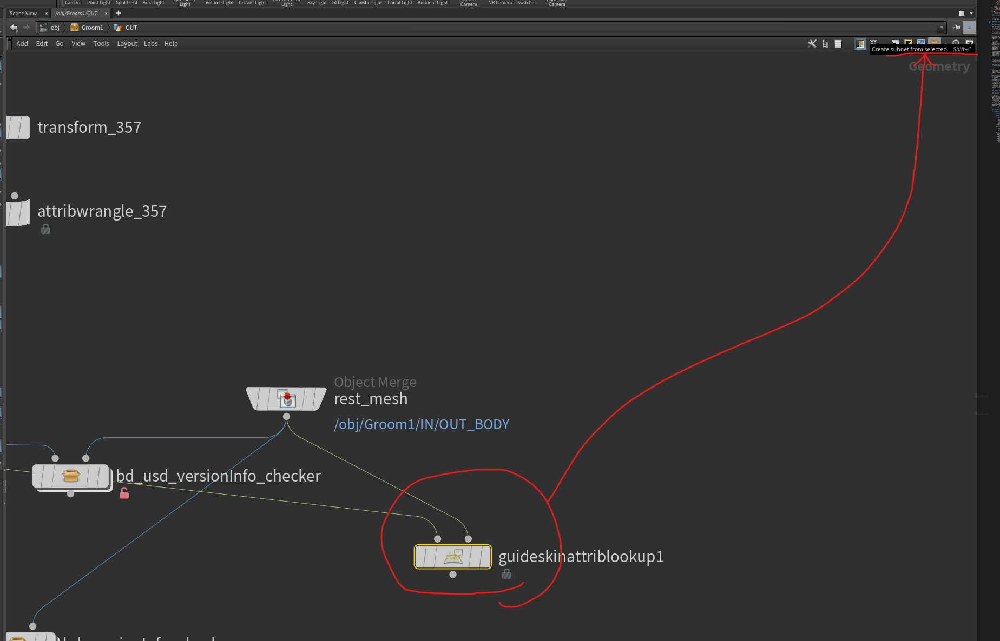
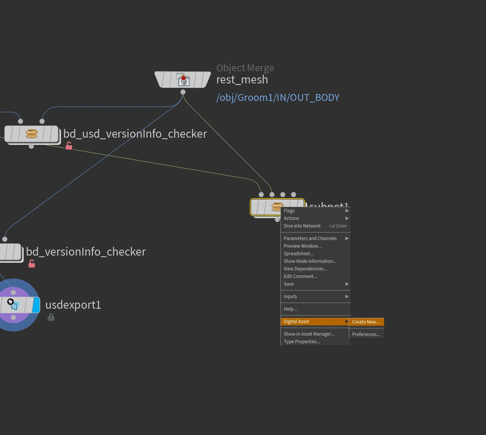
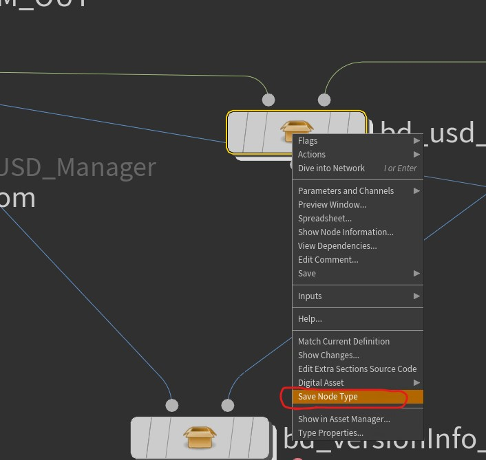
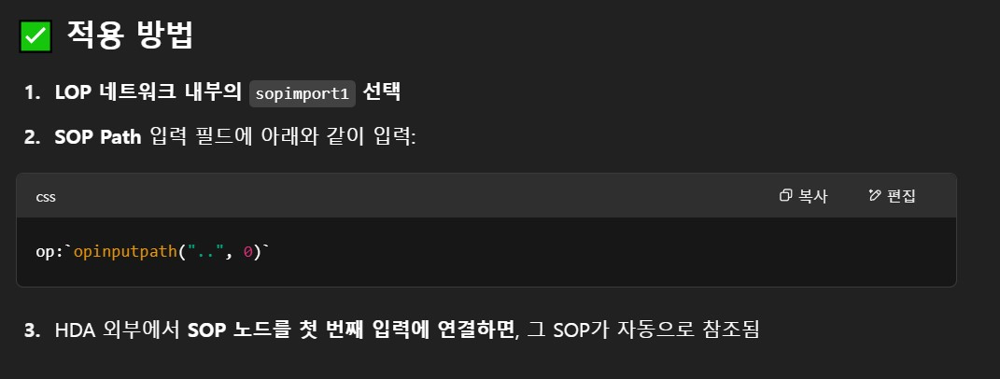
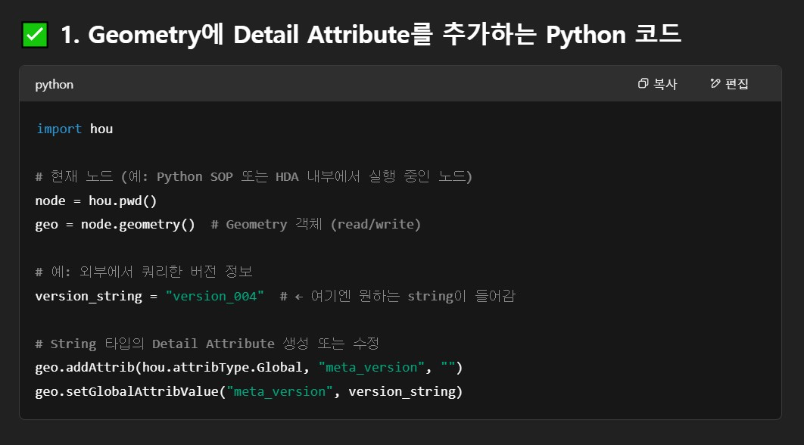

## Resources Links

### Main

- [Houdini Main Page](https://www.sidefx.com/docs/houdini/index.html)
- [Sidefx Learning Houdini](https://www.sidefx.com/learn/)

### Vex

- [Vex language reference](https://www.sidefx.com/docs/houdini/vex/lang.html#statements)
    - for basic syntax including types and statements
- [Using VEX expressions](https://www.sidefx.com/docs/houdini/vex/snippets.html)
  - [Indexing variables - like @ptnum, @primnum ... ](https://www.sidefx.com/docs/houdini/vex/snippets.html#indexing)
  - [Accessing globals - global variables](https://www.sidefx.com/docs/houdini/vex/snippets.html#accessing-globals)
  - [Accessing geometry attributes and info - like float -> @f ...](https://www.sidefx.com/docs/houdini/vex/snippets.html#attributes)
  - [Accessing attributes on other inputs of A.W node](https://www.sidefx.com/docs/houdini/vex/snippets.html#other_inputs)
  - [Vex Array](https://www.sidefx.com/docs/houdini/vex/snippets.html#arrays)
  - [Troubleshooting error messages - several cases](https://www.sidefx.com/docs/houdini/vex/snippets.html#accessing-globals)
  - [Vex Cheat Sheet from CGWiki](https://tokeru.com/cgwiki/VexCheatSheet.html)

### Hscript

- [Hscript language guide](https://www.sidefx.com/docs/houdini/commands/_guide.html)
- [Hscript api](https://www.sidefx.com/docs/houdini/commands/index.html)

### HDA (Houdini Digital Asset)
- [Add scripted controls and behavior](https://www.sidefx.com/docs/houdini/assets/asset_ui.html#add-scripted-controls-and-behavior)
  - [Type Properties window](https://www.sidefx.com/docs/houdini/ref/windows/optype.html)
    - Explanation on Tabs of Type Properties Window.
    - `Parameter tab` : how to call Python module which lies in HDA.
    - `Script tab` : how to save pythonModule which is used in `callback script`
  - [Details of Parameter Callback Script](https://www.sidefx.com/docs/houdini/hom/locations.html#parameter_callback_scripts)
    - First way how to call Python Module
  - [PythonModule (Asset Module)](https://www.sidefx.com/docs/houdini/hom/locations.html#asset_modules)

### Python
- [How to refer to code in other locations in your scripts](https://www.sidefx.com/docs/houdini/hom/locations.html#call)
  - it has Second way how to call Python Module
- [hou api documents](https://www.sidefx.com/docs/houdini/hom/hou/index.html)

### VDB 
- [Volume Basic](https://seveneleven-houdini.tistory.com/30)

### Other user's post
- [Houdini Starter](https://seveneleven-houdini.tistory.com/category/Houdini/Houdini1_Starter)


## Terminology


## Shortcuts
- Align nodes : a + move mouse with L click

## How to create HDA and work on it
1. create what you want to put

2. click `create subnet from selection`

3. keep working on the hda, saving the node type


## [Case study]
### Get SOP info from first input
- SOP level에서 LOP net을 만들고 이것을 감싸는 HDA를 만들었을때, 해당 HDA의 첫번째 input으로 들어오는 SOP object를 LOP network의 SOP import 노드의 SOP path parameter로 들고 오고싶어, 어떻게 SOP path parameter에 expression을 넣어야해 ??


### Save metadata in detail category
- HDA를 만든다고 할때, python으로 query한 string값의 metadata를 detail 항목으로 저장하고 싶다할때, 어떻게  python 코드를 작성해야돼 ?


### how to replace file ext at parameter ui

  ```python
  `strreplace(chs("../../../../lostworldlavaextbvine04a/alembic2/fileName"), ".abc", ".usda")`
  ```

### how to fetch a parameter value of other node at current node 

  1. Create cutom paramter
  2. Put other node address into the paramter
  3. Eval the value of parameter as node - `hou.parm.evalAsNode()`

  

### Build Assembly asset in LOP network


1. [SOP import node] Import sop object 
2. [Configure Prim / Configure Layer] Set kinds and purpose at Configure Prim, after that, Cache out the SOP object by setting `Save Path` parameter
  - 
3. Following that, Add the usd layer as a reference.
4. Create VariantSet, and add each usd layer under the VariantSet
5. Add Proxy layer as a payload, And Save model version information in a form of custom metadata


### [foreach] feedback vs merge

- **Feedback each iteration** : 말그대로, 매 iteration 마다, input 대상을 **갱신** 하면서 횟수만큼 하고자 하는 logic을 적용

- **Merge each iteration** : 횟수만큼 input 대상을 **복사**해서 각 대상에 logic을 적용.

- **Comparision**

    | Category | Feedback | Merge | 
    | -------- | -------- | ----- |
    | Example | img 1) <br>  | img 2) <br>  |
    | Explanation | input 대상이 하나이기 때문에 10 번 iteration 이후에도 primitive가 1개임을 알 수 있음 | input 대상을 10 번 복사 해서 각각 subdive를 적용하기 때문에, 10 개의 primitive가 각각 한번씩만 subdivide된것을 볼 수 있음 |

- Speicific **example** of **Feedback each iteration**

    | before | after |
    | ------ | ----- |
    | img 3) <br>  | img 4) <br>  |


### [foreach] How to debug and test loop
- [official houdini document](https://www.sidefx.com/docs/houdini/model/looping.html#debugging-and-testing-loops)


## [ Vex & Expression Syntax ] 

### Vex Data types
- [Vex Data types](https://www.sidefx.com/docs/houdini/vex/lang.html#data-types)


### Attribute types
- [Attribute types](https://www.sidefx.com/docs/houdini/vex/snippets.html#attributes)


```
// floats and integers
f@myfloat = 12.234; // float, vex assumes float if you don't specify prefix. Good if you're lazy, bad if you forget and mis-assign things!
i@myint = 5; // integer

// vectors
u@myvector2 = {0.6, 0.5}; // vector2 (2 floats)
v@myvector = {1,2,3}; // vector (3 floats)
p@myquat = {0,0,0,1}; // quaternion / vector4 / 4 floats

// matricies
2@mymatrix2 = {1,2,3,4}; // matrix2 (2x2 floats)
3@mymatrix3 = {1,2,3,4,5,6,7,8,9}; // matrix3 (3x3 floats)
4@mymatrix4 = {1,2,3,4,5,6,7,8,9,10,11,12,13,14,15,16}; // matrix (4x4 floats)

// strings and dictionaries
s@mystring = 'a string'; // string
d@mydict = {}; // dict, can only instantiate as empty type
d@mydict['key'] = 'value'; // can set values once instantiated
```


### Read Attribute
- [Read attribute](https://www.sidefx.com/docs/houdini/vex/attrib_suite.html#attrib)


### Write Attribute
- assign value to @attribute_name

```
...
@attr_name = value; # if the type is not specified here, it mean that it is float
f@attr_name = value;
s@path = replace(tar_path, "this_string", "to_string");
```

### String functions
- [Strings](https://www.sidefx.com/docs/houdini/vex/functions/index.html#string_group)
- Examples
  
  ```cpp
  string str = "abcdef abcdef abcdef";

  // Returns "abcghi abcghi abcghi"
  string new_str = replace(str, "def", "ghi");

  // Replaces up to 2 occurrences of the string "def".
  // Returns "abcghi abcghi abcdef"
  new_str = replace(str, "def", "ghi", 2);
  ```

## [ Python Cases]

### Get point or prim attributes

```python
tar_node = cur_node.parm("tar_parm_name").evalAsNode()
geo = tar_node.geometry()
prims_info = geo.prims()
first_element = None
if prims_info == ():
    first_element = geo.points()[0]
else:
    first_element = geo.prims()[0]
path_value = first_element.attribValue("path")
split_val = path_value.split("/")
```

## [ Foreach loop ]

