## Resource Links

### Main

- [Houdini Main Page](https://www.sidefx.com/docs/houdini/index.html)
- [Sidefx Learning Houdini](https://www.sidefx.com/learn/)

### Vex

- [Vex language reference](https://www.sidefx.com/docs/houdini/vex/lang.html#statements)
    - for basic syntax including types and statements
- [Using VEX expressions](https://www.sidefx.com/docs/houdini/vex/snippets.html)
  - [Indexing variables - like @ptnum, @primnum ... ](https://www.sidefx.com/docs/houdini/vex/snippets.html#indexing)
  - [Accessing globals - global variables](https://www.sidefx.com/docs/houdini/vex/snippets.html#accessing-globals)
  - [Accessing geometry attributes and info - like float -> @f ...](https://www.sidefx.com/docs/houdini/vex/snippets.html#attributes)
  - [Accessing attributes on other inputs of a Wrangle node](https://www.sidefx.com/docs/houdini/vex/snippets.html#other_inputs)
  - [Vex Array](https://www.sidefx.com/docs/houdini/vex/snippets.html#arrays)
  - [Troubleshooting error messages - several cases](https://www.sidefx.com/docs/houdini/vex/snippets.html#troubleshooting)
  - [Vex Cheat Sheet from CGWiki](https://tokeru.com/cgwiki/VexCheatSheet.html)

### Hscript

- [Hscript language guide](https://www.sidefx.com/docs/houdini/commands/_guide.html)
- [Hscript api](https://www.sidefx.com/docs/houdini/commands/index.html)

### HDA (Houdini Digital Asset)
- [Add scripted controls and behavior](https://www.sidefx.com/docs/houdini/assets/asset_ui.html#add-scripted-controls-and-behavior)
  - [Type Properties window](https://www.sidefx.com/docs/houdini/ref/windows/optype.html)
    - Explanation on Tabs of Type Properties Window.
    - `Parameter tab` : how to call Python module which lies in HDA.
    - `Script tab` : how to save pythonModule which is used in `callback script`
  - [Details of Parameter Callback Script](https://www.sidefx.com/docs/houdini/hom/locations.html#parameter_callback_scripts)
    - First way how to call Python Module
  - [PythonModule (Asset Module)](https://www.sidefx.com/docs/houdini/hom/locations.html#asset_modules)

### Python
- [How to refer to code in other locations in your scripts](https://www.sidefx.com/docs/houdini/hom/locations.html#call)
  - it has Second way how to call Python Module
- [hou api documents](https://www.sidefx.com/docs/houdini/hom/hou/index.html)

### VDB 
- [Volume Basic](https://seveneleven-houdini.tistory.com/30)

### Other user's post
- [Houdini Starter](https://seveneleven-houdini.tistory.com/category/Houdini/Houdini1_Starter)


## Terminology


## Shortcuts
- Align nodes in Network Editor : `a` + drag with left mouse button

## How to Create HDA

1. create what you want to put
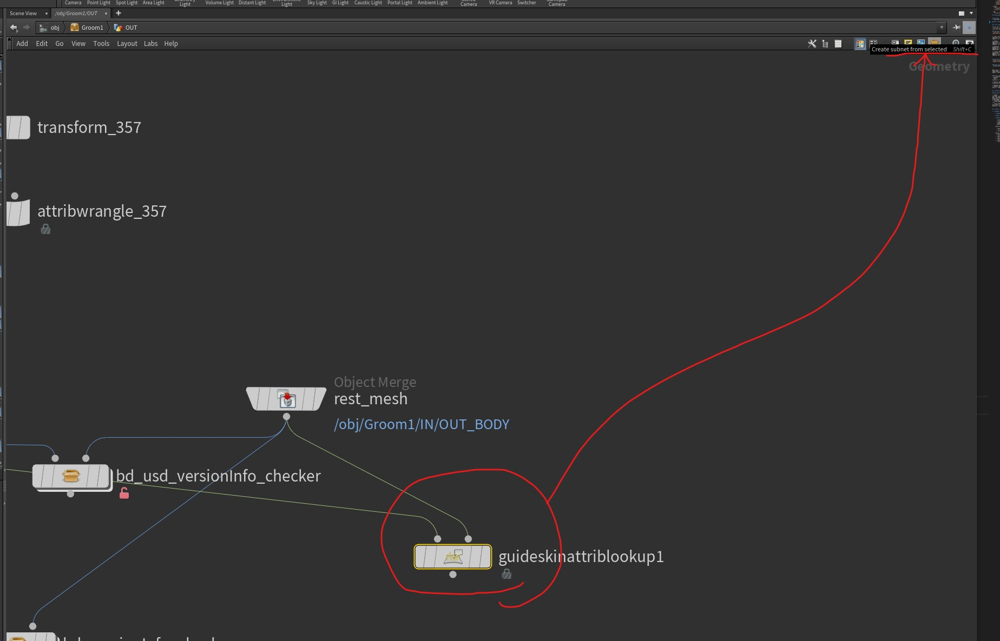
2. click `create subnet from selection`
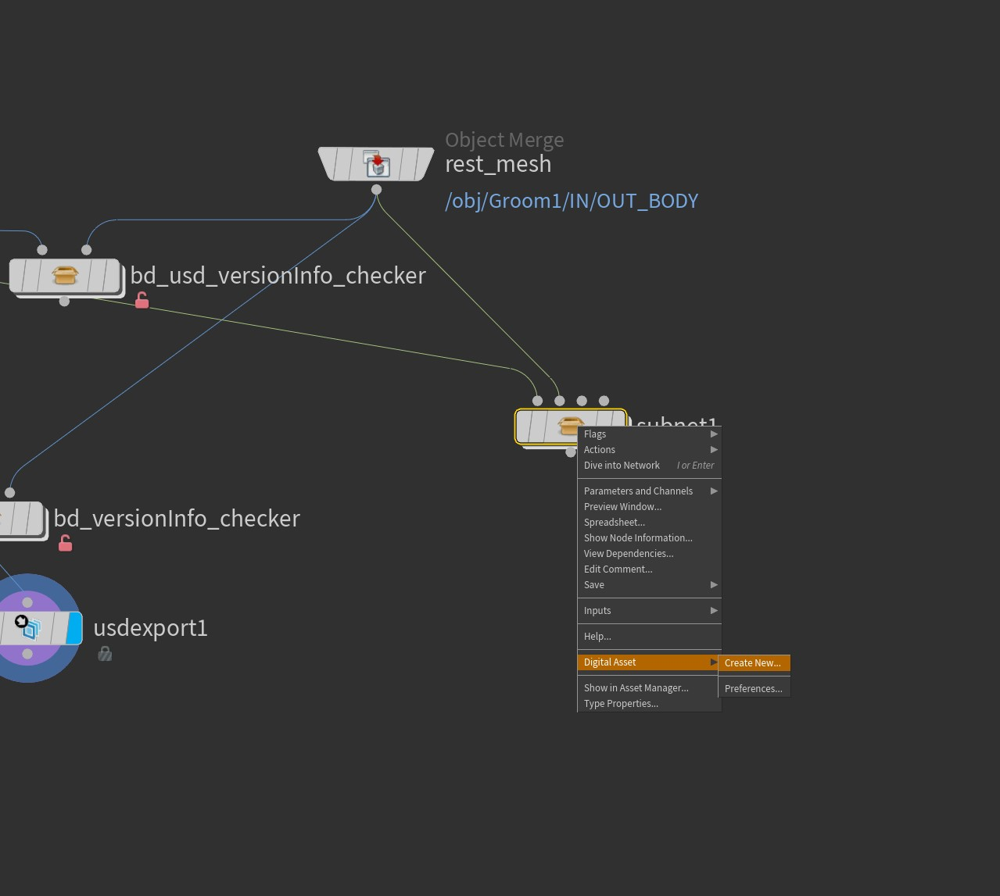
3. keep working on the hda, saving the node type
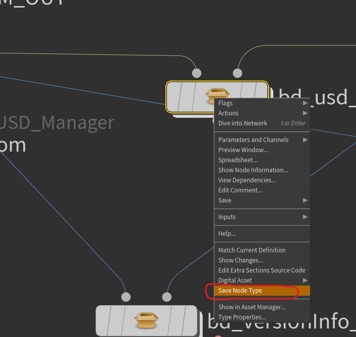

## Case Studies

### Get SOP info from first input
- SOP level에서 LOP net을 만들고 이것을 감싸는 HDA를 만들었을때, 해당 HDA의 첫번째 input으로 들어오는 SOP object를 LOP network의 SOP import 노드의 SOP path parameter로 들고 오고싶어, 어떻게 SOP path parameter에 expression을 넣어야해 ??
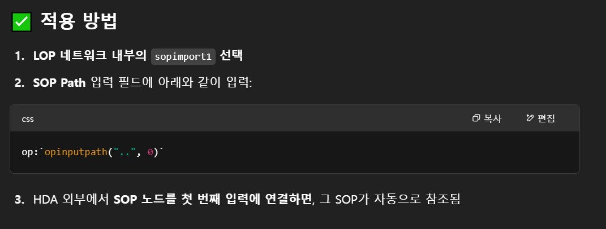

### Save metadata in detail category
- HDA를 만든다고 할때, python으로 query한 string값의 metadata를 detail 항목으로 저장하고 싶다할때, 어떻게  python 코드를 작성해야돼 ?
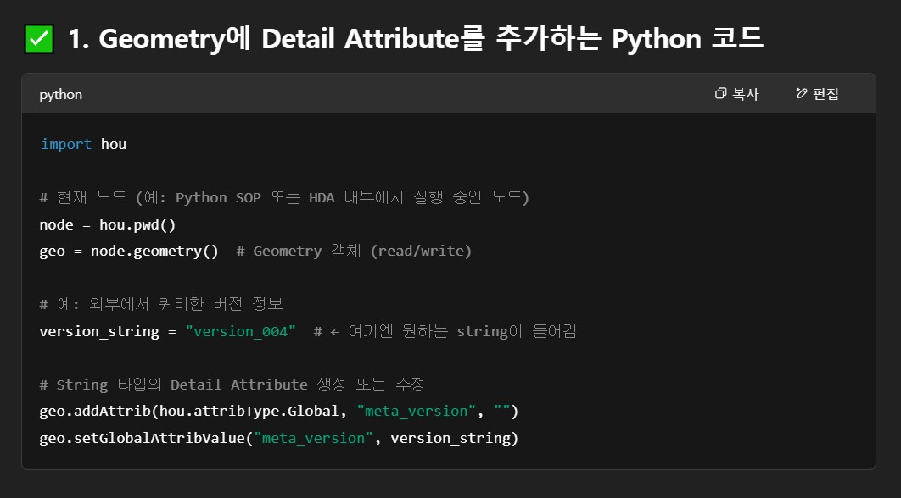

### Replace file extension in parameter expression

  ```
  `strreplace(chs("../../../../lostworldlavaextbvine04a/alembic2/fileName"), ".abc", ".usda")`
  ```

  > Note: `strreplace()` here is an **Hscript expression** function (used inside backtick expansion in parameter fields), not a VEX function. The VEX equivalent is `replace()`.

### Fetch a parameter value from another node

  1. Create a custom parameter
  2. Put the other node's path into the parameter
  3. Evaluate the parameter value as a node reference — `parm_obj.evalAsNode()`

  

### Build Assembly asset in LOP network


1. [SOP import node] Import sop object 
2. [Configure Prim / Configure Layer] Set kinds and purpose at Configure Prim, after that, Cache out the SOP object by setting `Save Path` parameter
  - 
3. Following that, Add the usd layer as a reference.
4. Create VariantSet, and add each usd layer under the VariantSet
5. Add Proxy layer as a payload, And Save model version information in a form of custom metadata

### Foreach — feedback vs merge

- **Feedback each iteration** : 말그대로, 매 iteration 마다, input 대상을 **갱신** 하면서 횟수만큼 하고자 하는 logic을 적용. 하나의 대상에 반복 작업을 누적할 때 사용.

- **Merge each iteration** : 횟수만큼 input 대상을 **복사**해서 각 대상에 logic을 적용. 복수의 결과를 병렬적으로 만들 때 사용.

- **Comparison**

    | Category | Feedback | Merge | 
    | -------- | -------- | ----- |
    | Example | img 1) <br> 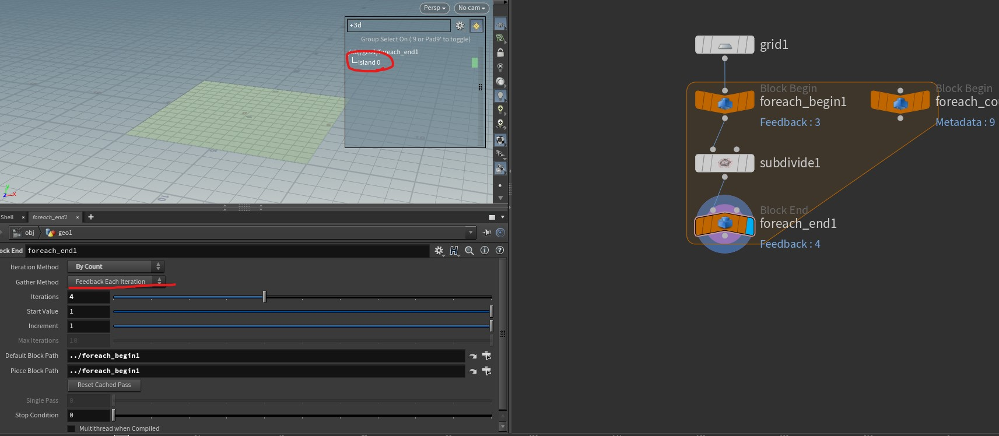 | img 2) <br> 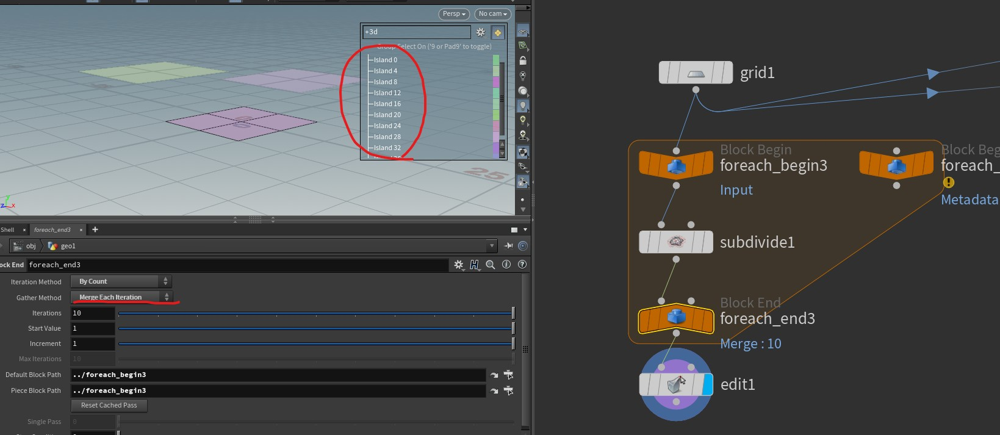 |
    | Explanation | input 대상이 하나이기 때문에 10 번 iteration 이후에도 primitive가 1개임을 알 수 있음 | input 대상을 10 번 복사 해서 각각 subdive를 적용하기 때문에, 10 개의 primitive가 각각 한번씩만 subdivide된것을 볼 수 있음 |

- Specific **example** of **Feedback each iteration**

    | before | after |
    | ------ | ----- |
    | img 3) <br> 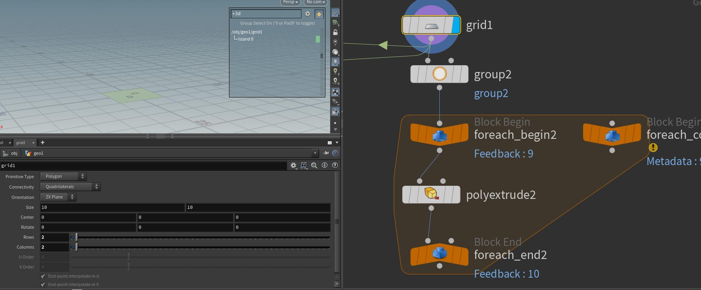 | img 4) <br> 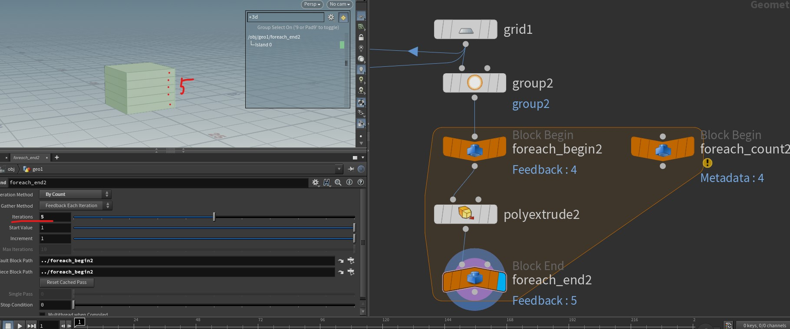 |


### Foreach — debug and test loop
- [official houdini document](https://www.sidefx.com/docs/houdini/model/looping.html#debugging-and-testing-loops)


## Vex and Expression Syntax

### Vex Data types
- [Vex Data types](https://www.sidefx.com/docs/houdini/vex/lang.html#data-types)
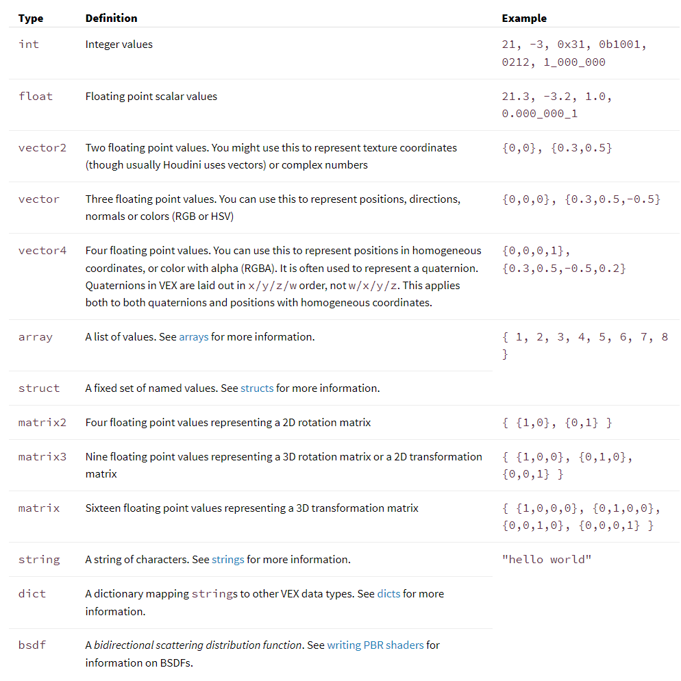

### Attribute types
- [Attribute types](https://www.sidefx.com/docs/houdini/vex/snippets.html#attributes)
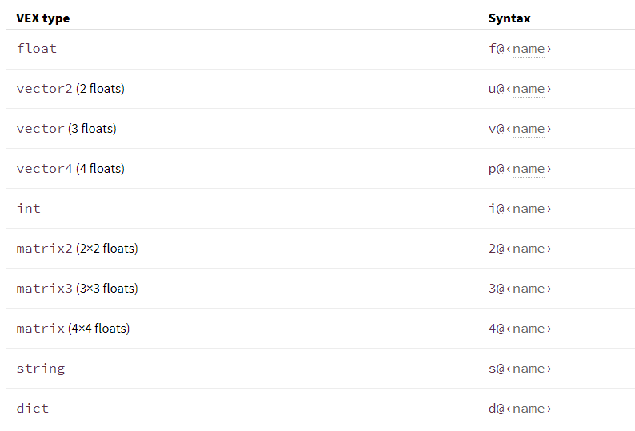

```cpp
// floats and integers
f@myfloat = 12.234; // float, vex assumes float if you don't specify prefix. Good if you're lazy, bad if you forget and mis-assign things!
i@myint = 5; // integer

// vectors
u@myvector2 = {0.6, 0.5}; // vector2 (2 floats)
v@myvector = {1,2,3}; // vector (3 floats)
p@myquat = {0,0,0,1}; // quaternion / vector4 / 4 floats

// matricies
2@mymatrix2 = {1,2,3,4}; // matrix2 (2x2 floats)
3@mymatrix3 = {1,2,3,4,5,6,7,8,9}; // matrix3 (3x3 floats)
4@mymatrix4 = {1,2,3,4,5,6,7,8,9,10,11,12,13,14,15,16}; // matrix (4x4 floats)

// strings and dictionaries
s@mystring = 'a string'; // string
d@mydict = {}; // dict, can only instantiate as empty type
d@mydict['key'] = 'value'; // can set values once instantiated
```


### Read Attribute
- [Read attribute](https://www.sidefx.com/docs/houdini/vex/attrib_suite.html#attrib)
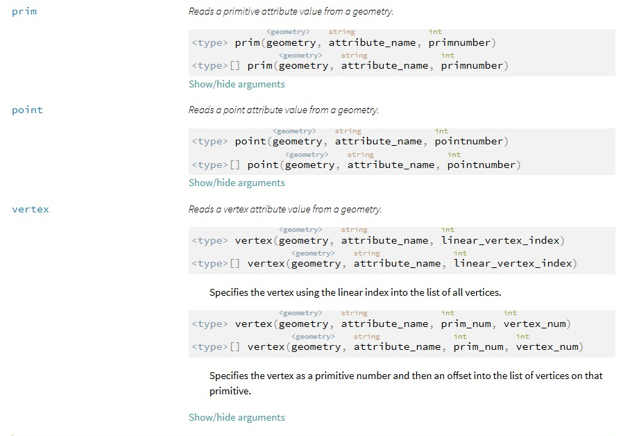


### Write Attribute
- assign value to `@attribute_name`

```cpp
// if the type prefix is omitted, VEX assumes float
@attr_name = value;
f@attr_name = value;
s@path = replace(tar_path, "this_string", "to_string");
```

### String functions
- [Strings](https://www.sidefx.com/docs/houdini/vex/functions/index.html#string_group)
- Examples
  
  ```cpp
  string str = "abcdef abcdef abcdef";

  // Returns "abcghi abcghi abcghi"
  string new_str = replace(str, "def", "ghi");

  // Replaces up to 2 occurrences of the string "def".
  // Returns "abcghi abcghi abcdef"
  new_str = replace(str, "def", "ghi", 2);
  ```

### chf()

하드코딩된 0.3 대신, 노드에 새로 만든 스파라미터 amp(슬라이더, 0~1)의 값을 코드가 실행 시점에 읽어옵니다. chf = "channel float"의 약자로, 파라미터를 코드 밖(UI)으로 노출하는 표준 패턴입니다. 

"EXPOSE THE KNOBS — 하드코딩하지 말고 파라미터로 빼라"는 원칙이 있는데, 바로 이걸 말하는 겁니다

```cpp
@P.y += sin(@P.x * 3 + @Time * 2) * chf("amp");
```

### For loop


#### 1. 전형적인 C타입 `for` 루프 (가장 기본형)

특정 횟수만큼 반복하거나, 인덱스(i)를 직접 제어해야 할 때 사용합니다.

```c
// 문법 구조
for (초기화; 조건식; 증감식) {
    // 반복할 코드
}

```

##### 💡 예시: 포인트들을 위로 계단식으로 쌓기 (Attribute Wrangle - Detail 모드)

디테일 모드에서 포인트 10개를 생성하면서, 루프를 돌 때마다 Y축 높이를 점점 높이는 예제입니다.

```c
int num_points = 10;

for (int i = 0; i < num_points; i++) {
    // 반복할 때마다 i가 0, 1, 2... 순서대로 증가합니다.
    vector pos = set(i * 0.5, i * 1.0, 0); // X축과 Y축 위치 계산
    
    // 새로운 포인트 생성
    int new_pt = addpoint(0, pos);
}

```

---

#### 2. `foreach` 루프 (배열 순회형)

VEX에서 정말 자주 쓰이는 형태입니다. **배열(Array)의 모든 요소를 처음부터 끝까지 하나씩 꺼내올 때** 사용하며, 인덱스를 번거롭게 계산할 필요가 없어 코드가 깔끔해집니다.

```c
// 문법 구조
foreach (요소타입 변수명; 배열) {
    // 반복할 코드
}

// (선택사항) 인덱스 번호도 같이 가져오고 싶을 때
foreach (int index; 요소타입 변수명; 배열) { ... }

```

##### 💡 예시: 포인트의 인근 포인트(Neighbors) 찾아 처리하기 (Attribute Wrangle - Point 모드)

현재 포인트와 연결된 이웃 포인트들의 ID 배열을 가져와서, 그들의 색상(Cd)을 평균 내는 예제입니다.

```c
// 현재 포인트와 선으로 연결된 이웃 포인트들의 ID를 배열로 가져옵니다.
int neighbors[] = neighbours(0, @ptnum);

vector total_color = set(0,0,0);

// foreach를 사용해 배열 안의 이웃 ID를 하나씩 꺼냅니다.
foreach (int neighbor_pt; neighbors) {
    // 이웃 포인트의 색상을 가져와 더합니다.
    total_color += point(0, "Cd", neighbor_pt);
}

// 이웃들의 평균 색상을 현재 포인트의 색상으로 지정
int count = len(neighbors);
if (count > 0) {
    @Cd = total_color / count;
}

```

---

#### 3. `for` 루프를 이용한 String(문자열)이나 Group 순회

특정 그룹에 속한 포인트들이나 프리미티브를 돌 때도 `for` 루프를 유용하게 씁니다.

##### 💡 예시: 특정 그룹의 포인트만 골라서 처리하기 (Attribute Wrangle - Detail 모드)

`expandpointgroup` 함수를 사용해 "my_group"에 속한 모든 포인트 ID를 배열로 만든 뒤 순회합니다.

```c
// "my_group"에 포함된 포인트 번호들을 배열로 리턴받습니다.
int pts_in_group[] = expandpointgroup(0, "my_group");

foreach (int pt; pts_in_group) {
    // 그룹에 속한 포인트들의 Y축 높이를 2배로 만듭니다.
    vector pos = point(0, "P", pt);
    pos.y *= 2.0;
    
    setpointattrib(0, "P", pt, pos, "set");
}

```

---

### ⚠️ VEX 루프 사용 시 주의할 점 (꿀팁)

* **성능 최적화**: VEX는 원래 병렬 처리(Parallel Processing)에 특화되어 있습니다. Point 모드나 Primitive 모드 자체 이미 모든 포인트에 대해 알아서 루프를 돌고 있는 상태입니다. 따라서 "모든 포인트의 위치를 바꾸기 위해 Point 모드 안에서 또 전체 포인트를 `for` 루프로 돌리는 것"은 엄청난 성능 저하를 일으킵니다. 루프는 꼭 필요한 경우(이웃 데이터 조회, 배열 처리 등)에만 좁은 범위로 사용하는 것이 좋습니다.
* **무한 루프 방지**: C타입 `for` 루프를 쓸 때 조건식을 잘못 적으면 후디니가 멈출(Crash) 수 있습니다. 안전하게 배열을 다룰 때는 `foreach`를 우선적으로 고려하세요.

## Python Cases

### Get point or prim attributes

```python
tar_node = cur_node.parm("tar_parm_name").evalAsNode()
geo = tar_node.geometry()
prims_info = geo.prims()
first_element = None
if prims_info == ():
    first_element = geo.points()[0]
else:
    first_element = geo.prims()[0]
path_value = first_element.attribValue("path")
split_val = path_value.split("/")
```

## Global Variables

### @Time

@Time은 Houdini가 자동으로 바인딩해주는 전역 변수로, 현재 프레임에 해당하는 초 단위 시간입니다(24fps 기준 frame 12 = 약 0.458초).